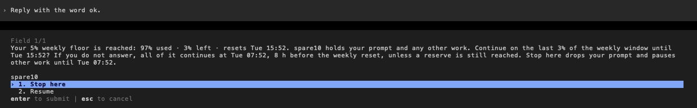
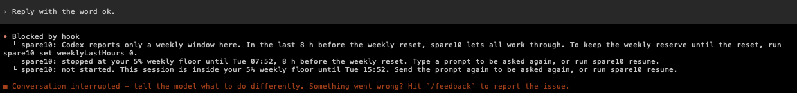
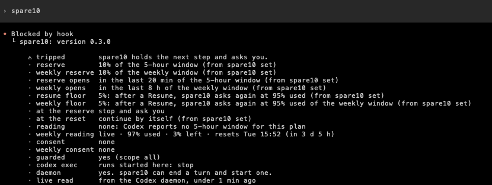

# spare10-mod

A quota circuit breaker for Claude Code and the OpenAI Codex CLI.
It keeps the last part of your 5-hour and weekly quota windows for you.

The idea comes from [spare10](https://github.com/alesdi/spare10) by Alessandro Diano.
spare10 wraps the `claude` command and stops Claude Code before the quota runs out.
spare10-mod keeps the idea and moves it into the agent, as a plugin.
Many texts and rules come from spare10.
Thank you, Alessandro.

spare10-mod is early access software.
In Claude Code, it uses function hooks, an early access feature of Claude Code 2.1.281 and later.
In Codex, it uses plugin hooks and a small MCP server. It is tested on Codex CLI 0.157.0.
The plugin name is `spare10` in both.

## What spare10 does

spare10 watches two quota windows: the 5-hour window and the weekly window.
By default, it keeps the last 10% of each window for you.
At the reserve of either window, spare10 holds all work at the next step.
It then asks you one question: **Stop here** or **Resume**.

- **Resume** continues all held work from the point where it stopped.
  It lasts until the floor, by default until 5% is left.
  There spare10 asks a second time.
  A second **Resume** lets the work use the rest of the window.
- **Stop here** ends the work at its next step.
  The session stays open.

Near the reset, a reserve that you do not use is lost.
So spare10 opens the reserve in the last 20 minutes of the 5-hour window and the last 8 hours of the weekly window.
Then, or after the reset, spare10 continues held and stopped work by itself.
You can switch each of these off.

## Quick start

### Claude Code

1. Switch on function hooks.
   Put this `env` entry in `~/.claude/settings.json`:

   ```json
   { "env": { "CLAUDE_CODE_ENABLE_FUNCTION_HOOKS": "1" } }
   ```

   If the file has an `env` block already, add only the `CLAUDE_CODE_ENABLE_FUNCTION_HOOKS` line to it.
   This flag switches on function hooks for every installed plugin that has a hooks module.
   [Before you start](docs/claude-code.md#before-you-start) tells you more.

   <details>
   <summary>Or add the entry with one jq command</summary>

   Run this command in bash, zsh or sh. It needs [jq](https://jqlang.org). macOS has jq in `/usr/bin`.

   ```sh
   sh -c 'f="${CLAUDE_CONFIG_DIR:-$HOME/.claude}/settings.json"; s="$f"; [ -e "$f" ] || s=/dev/null; t=$(mktemp) || exit 1; jq -s "if length > 1 then error(\"more than one JSON value\") else (.[0] // {}) | .env.CLAUDE_CODE_ENABLE_FUNCTION_HOOKS = \"1\" end" "$s" > "$t" || { rm -f "$t"; exit 1; }; mkdir -p "$(dirname "$f")" && cat "$t" > "$f" || { echo "Could not write $f. The new settings are in $t" >&2; exit 1; }; rm -f "$t"; echo "Function hooks are on in $f"'
   ```

   The command keeps your other settings. jq rewrites the file with two-space indentation.
   If jq cannot read or parse the file, the command shows an error and changes nothing.
   If you export `CLAUDE_CONFIG_DIR`, the command uses that folder, as Claude Code does.
   Run it once for each config folder that you use.

   </details>

2. Install the plugin:

   ```sh
   claude plugin marketplace add chrisns/spare10-mod
   claude plugin install spare10@spare10
   ```

   The install can say that 11 `userConfig` options are not set yet.
   You do not have to set them. The defaults apply until you change them in `/config`.

3. Start a new Claude Code session in a terminal.
   spare10 arms itself. You do not need a command.
   The footer shows `⧗ spare10` until spare10 reads your quota. Then it shows `● spare10`.
   Type `/spare10` to see the full status.

<details>
<summary>If spare10 does not load in Claude Code</summary>

- Type `/` to see the command list. If `/spare10` is not in the list, spare10 did not load.
- Make sure that you use Claude Code 2.1.281 or later.
- Check step 1 and step 2, then start a new session.
- Claude Code ignores a settings file that has an error in it.
  Run `claude doctor`. If it shows **Invalid settings**, correct that entry.
- A `"0"` in the `env` block of a project's `.claude/settings.json` switches function hooks off in that project.
- The desktop app and the IDE hosts are unattended.
  There, spare10 only watches by default.
  See [Unattended runs](docs/configure.md#unattended-runs).

</details>

### Codex CLI

You need Node.js 20 or later.
spare10 looks for it on your `PATH`, in Homebrew, in Volta and in nvm.

1. Install the plugin:

   ```sh
   codex plugin marketplace add chrisns/spare10-mod
   codex plugin add spare10@spare10
   ```

2. Start `codex`. Codex shows **Hooks need review**.
   Choose **Trust all and continue**.
   Codex runs plugin hooks only after you trust them.
   `codex exec` never asks, so trust the hooks once in the TUI first.

3. Type `spare10` as the whole prompt, and press Enter.
   spare10 shows its status in the transcript, and sends nothing to the model.

<details>
<summary>Run a spare10 command during a Codex turn</summary>

Use the Codex shell prefix `!`, such as `!spare10 resume`.
Codex does not use your shell aliases there.
So add the spare10 folder to your `PATH` in `~/.zshrc` or `~/.bashrc`:

```sh
export PATH="$HOME/.codex/plugins/data/spare10-spare10/bin:$PATH"
```

If you set `CODEX_HOME`, use that folder in place of `$HOME/.codex`.
Start a new Codex session after you change the file.
See [Install in Codex](docs/codex.md#install-in-codex).

</details>

<details>
<summary>If Codex cannot start a session</summary>

spare10 starts one small Node.js process for each Codex thread.
If spare10 finds no Node.js 20 or later, Codex cannot start a session.
This includes the Codex desktop app and the IDE extension.
Install Node.js 20 or later, or remove the plugin:

```sh
codex plugin remove spare10@spare10
```

You can also set `enabled = false` under `[plugins."spare10@spare10"]` in `~/.codex/config.toml`.

</details>

### Try it

A test reading trips spare10 at any time.
It spends no quota when you choose **Stop here**.

1. Type `/spare10 simulate 92` in Claude Code, or `spare10 simulate 92` in Codex.
2. Send a prompt. spare10 asks you.
3. Choose **Stop here**. spare10 drops the prompt, and no request goes to the model.
4. Type `/spare10 simulate off`, or `spare10 simulate off` in Codex, to clear the test reading.

If the 5-hour window resets in less than 20 minutes, the reserve is open, and spare10 does not ask.
Then use `simulate 92 in 1h`.
See [Test reading](docs/claude-code.md#test-reading).

## Screenshots

### Claude Code

The badge at the right of the prompt footer, and the `/spare10` report:


At the reserve, spare10 holds the work and asks you:


<details>
<summary>After Stop here, and when the reserve opens</summary>

After **Stop here**, the work stops until the reserve opens, 20 min before the reset:


When the reserve opens, spare10 continues the stopped work by itself:


</details>

These screenshots use a test reading from `/spare10 simulate`, so they show `(test)`.
They come from spare10-mod 0.2, which had no floor.

### Codex

At the reserve, spare10 asks you in a Codex form:



**Stop here** drops the prompt. Codex sends no model request:



<details>
<summary>The status report in Codex</summary>



</details>

The Codex screenshots show a real account whose plan has only a weekly window.

## Commands

| What it does | Claude Code | Codex |
|---|---|---|
| Show the status | `/spare10` | `spare10` |
| Continue on the reserve | `/spare10 resume` | `spare10 resume` |
| Stop at the reserve now | `/spare10 stop` | `spare10 stop` |
| Set a test reading | `/spare10 simulate 92` | `spare10 simulate 92` |
| Change an option | `/config` | `spare10 set reserve 15` |

In Codex, type the command as the whole prompt.
During a turn, put `!` in front of it.

## Options

| Option | Default | What it does |
|---|---|---|
| `reserve` | `10` | The percent of the 5-hour window that you keep. |
| `weeklyReserve` | `10` | The percent of the weekly window that you keep. `0` switches the weekly guard off. |
| `lastMinutes` | `20` | spare10 opens the reserve in these last minutes of the 5-hour window. `0` switches this off. |
| `weeklyLastHours` | `8` | spare10 opens the weekly reserve in these last hours of the weekly window. `0` switches this off. |
| `resumeFloor` | `5` | After a **Resume**, spare10 asks again when this percent of the 5-hour window is left. |
| `weeklyResumeFloor` | `5` | The same for the weekly window. |
| `pausePrompt` | empty | Text here tells the agents to wind down, and spare10 stops nothing. |
| `autoResume` | on | spare10 continues held and stopped work when the reserve opens, or after the reset. |
| `headless` | `off` | What spare10 does in unattended runs: `off`, `prompt`, `stop` or `wait`. |
| `scope` | `all` | `all` guards every interactive session. `opt-in` guards only runs started with `SPARE10=on`. |
| `badge` | on | Shows the badge in the Claude Code footer. Codex has no badge. |

In Claude Code, set the options in `/config`, in the row for spare10.
In Codex, use `spare10 set <option> <value>`.
A `SPARE10_*` variable changes an option for one run.
See [Configure](docs/configure.md).

## Learn more

- [spare10 in Claude Code](docs/claude-code.md): the question, the resume floor, the open reserve, the reset, the badge and the `/spare10` command.
- [spare10 in Codex](docs/codex.md): the install, the question, the commands and the differences from Claude Code.
- [Configure](docs/configure.md): scope, options, variables and unattended runs.
- [How spare10 works](docs/how-it-works.md): the design, a comparison with spare10, and the known limitations.
- [Develop](docs/develop.md): the checks, the layout and the rules for contributors.
- [Changelog](CHANGELOG.md)

## License

MIT. See [LICENSE](LICENSE).
spare10-mod ports texts and design from spare10 by Alessandro Diano, also under the MIT license.
