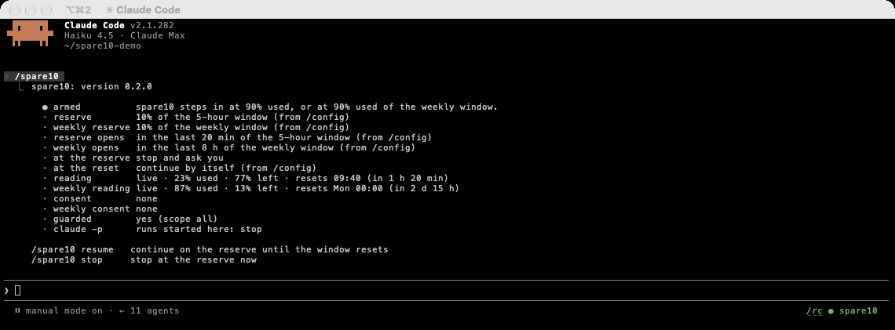
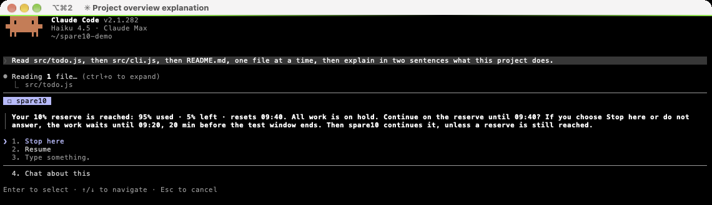
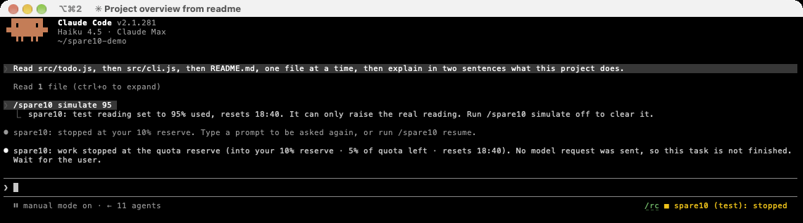

# spare10-mod

A quota circuit breaker for Claude Code, built as a mod.
It keeps the last part of your 5-hour and weekly quota windows for you.

The idea comes from [spare10](https://github.com/alesdi/spare10) by Alessandro Diano.
spare10 wraps the `claude` command and stops Claude Code before the quota runs out.
spare10-mod keeps the idea and moves it into Claude Code, as a plugin with function hooks.
Many texts and rules come from spare10.
Thank you, Alessandro.

spare10-mod is early access software.
It uses function hooks, an early access feature of Claude Code 2.1.281.
The plugin name is `spare10`.

## Quick start

1. Switch on function hooks.
   This flag switches them on for every installed plugin that has a hooks module.
   [Before you start](#before-you-start) tells you more.

   Put this `env` entry in `~/.claude/settings.json`:

   ```json
   { "env": { "CLAUDE_CODE_ENABLE_FUNCTION_HOOKS": "1" } }
   ```

   If the file has an `env` block already, add only the `CLAUDE_CODE_ENABLE_FUNCTION_HOOKS` line to it.

   Or run this command in bash, zsh or sh. It needs [jq](https://jqlang.org). macOS has jq in `/usr/bin`.

   ```sh
   sh -c 'f="${CLAUDE_CONFIG_DIR:-$HOME/.claude}/settings.json"; s="$f"; [ -e "$f" ] || s=/dev/null; t=$(mktemp) || exit 1; jq -s "if length > 1 then error(\"more than one JSON value\") else (.[0] // {}) | .env.CLAUDE_CODE_ENABLE_FUNCTION_HOOKS = \"1\" end" "$s" > "$t" || { rm -f "$t"; exit 1; }; mkdir -p "$(dirname "$f")" && cat "$t" > "$f" || { echo "Could not write $f. The new settings are in $t" >&2; exit 1; }; rm -f "$t"; echo "Function hooks are on in $f"'
   ```

   The command keeps your other settings. jq rewrites the file with two-space indentation.
   If jq cannot read or parse the file, the command shows an error and changes nothing.
   If you export `CLAUDE_CONFIG_DIR`, the command uses that folder, as Claude Code does.
   Run it once for each config folder that you use.

2. Install the plugin:

   ```sh
   claude plugin marketplace add chrisns/spare10-mod
   claude plugin install spare10@spare10
   ```

   The install can say that 7 `userConfig` options are not set yet.
   You do not have to set them. The defaults apply until you change them in `/config`.

3. Start a new Claude Code session in a terminal.
   spare10 arms itself. You do not need a command.
   The footer shows `⧗ spare10` until spare10 reads your quota.
   Then it shows `● spare10`.
   Type `/spare10` to see the full status.

   The desktop app and the IDE hosts are unattended.
   There, spare10 only watches by default.
   See [Unattended runs](#unattended-runs).

If spare10 does not load:

- Type `/` to see the command list. If `/spare10` is not in the list, spare10 did not load.
- Make sure that you use Claude Code 2.1.281.
- Check step 1 and step 2, then start a new session.
- Claude Code ignores a settings file that has an error in it.
  Run `claude doctor`. If it shows **Invalid settings**, correct that entry.
- A `"0"` in the `env` block of a project's `.claude/settings.json` switches function hooks off in that project.

To test the question, type `/spare10 simulate 95`, then send a prompt.
Choose **Stop here**, and the test uses no quota.
Type `/spare10 simulate off` to clear the test reading.

## Screenshots

The badge at the right of the prompt footer, and the `/spare10` report:



At the reserve, spare10 holds the work and asks you:



After **Stop here**, the work ends at its next step and the session stays open:



## What spare10 does

spare10 watches two quota windows: the 5-hour window and the weekly window.
By default, it keeps the last 10% of each window for you.
At the reserve of either window, spare10 holds all work at the next step.
It then asks you one question in the Claude Code dialog: **Stop here** or **Resume**.
**Resume** continues all held work from the point where it stopped.
**Stop here** ends the work at its next step, but the session stays open.
After the reset, spare10 continues held and stopped work by itself.
You can switch this off.

## Before you start

You need Claude Code 2.1.281.
spare10-mod targets this version only.
Function hooks are early access.
A later version can change their API without notice.

Function hooks are off by default.
To switch them on, put this `env` entry in `~/.claude/settings.json`:

```json
{ "env": { "CLAUDE_CODE_ENABLE_FUNCTION_HOOKS": "1" } }
```

This setting switches on function hooks for **every** installed plugin that has a hooks module.
It applies in every session.
spare10 did not change `~/.claude`, so this step is new in spare10-mod.

You can use a narrower route, but each route has a cost:

- `claude --settings <file>` switches on function hooks for one launch only.
  A `claude --bg` launch also needs `--settings`.
  Pane teammates probably get the `--settings` file of the lead too.
- The `env` block of a project's `.claude/settings.json` switches them on for that project only.
- A flag that you set only in the shell does not reach `--bg` sessions or pane teammates.
  spare10 warns you about this at the start of a session.
  A flag in a settings file or a `--settings` file gives no warning.

## Install

Add the marketplace, then install the plugin:

```sh
claude plugin marketplace add chrisns/spare10-mod   # or the path to a local clone
claude plugin install spare10@spare10
```

Start a new session and type `/spare10` to see the status.

To develop, load the plugin from the repo folder.
First disable the installed copy, if you have one:

```sh
claude plugin disable spare10@spare10
claude --plugin-dir .
```

Both copies add the same `$.spare10` noun.
When both load, one of them unloads.

## Use

### The question

At the reserve, spare10 holds each loop at its next tool call or model request.
This includes the main loop, subagents, background agents, workflow agents and in-process teammates.
A tool that already runs is never cut.
The first held step opens one question for the whole session.
All other held steps join it.

```
 ☐ spare10
Your 10% reserve is reached: 91% used · 9% left · resets 14:00. All work is on hold. Continue on the reserve until 14:00? If you choose Stop here or do not answer, the work waits until 14:00. Then spare10 continues it, unless a reserve is still reached.
❯ 1. Stop here
  2. Resume
  3. Type something.
  4. Chat about this
Enter to select · ↑/↓ to navigate · Esc to cancel
```

With **Continue at the reset** off, the question ends at `Continue on the reserve until 14:00?`

The weekly window has the same question, with the weekly wording.
Its times show the weekday, such as `Mon 09:00`.
A reset more than 6 days away also shows the date, such as `Thu 1 Oct 11:00`.
When both windows are in the reserve, one question names both:

```
Your 10% reserve and your 10% weekly reserve are reached: 5-hour window 91% used · 9% left · resets 14:00, weekly window 92% used · 8% left · resets Mon 09:00. All work is on hold. Continue on both reserves until they reset (14:00 and Mon 09:00)? If you choose Stop here or do not answer, the work waits until Mon 09:00. Then spare10 continues it, unless a reserve is still reached.
```

The question names the windows that are in the reserve when it opens.
Another window can reach its reserve while the question waits.
Your answer does not apply to that window.
After your answer, spare10 asks you again about it.

**Stop here** has the focus, so a stray Enter never spends the reserve.
Only the exact label `Resume` continues.
A typed `Resume` under `Type something.` also continues.
All other answers are **Stop here**: Esc, `Chat about this`, other text, and a dialog that closes with no answer.

**Resume**:

- Each held tool call runs.
- Each held model request goes out.
- A held prompt enters.
- The model reads nothing extra, because it does not know that it waited.
- spare10 stays quiet until each window that the question names resets.
- The transcript shows `spare10: continuing on your 10% reserve. spare10 stays quiet until 14:00.`

**Stop here**:

- spare10 denies each held tool call.
- spare10 answers each held model request itself, and sends no request.
- spare10 ends the main turn, so a Stop hook cannot start the loop again.
- spare10 refuses all later steps until the reset, or until you continue.
- The session stays open and idle.
- With **Continue at the reset** on, spare10 continues the stopped work after the reset.
  It sends Claude a short message that the stop is over.
- The transcript shows `spare10: stopped at your 10% reserve until 14:00. Then spare10 continues the work, unless a reserve is still reached. Type a prompt to be asked again, or run /spare10 resume.`
- With the option off, the transcript shows `spare10: stopped at your 10% reserve. Type a prompt to be asked again, or run /spare10 resume.`

The model reads one of these texts after a Stop:

```
spare10: the user stopped work at the quota reserve (into your 10% reserve · 9% of quota left · resets 14:00). Stop now and wait for the user. Do not call any further tools.
spare10: work stopped at the quota reserve (into your 10% reserve · 9% of quota left · resets 14:00). No model request was sent, so this task is not finished. Wait for the user.
```

### At the reset

This part applies with **Continue at the reset** on, which is the default.
spare10 does not act at the exact time of the reset.
It waits 5 minutes after the reset, and then reads the quota again.
A window that is still in its reserve keeps the work on hold.

**An open question.**
If nobody answers, the held work continues after the reset, unless a reserve is still reached.
spare10 removes the dialog and writes no consent.
The transcript shows `spare10: the 5-hour window reset. Held work continues.`
If another window is still in its reserve, a new question holds the work.
The transcript then shows `spare10: the 5-hour window reset, but your 10% weekly reserve is reached. Held work still waits.`

The quota can leave the reserve before the reset, for example after a limit reset.
Then the held work continues within about a minute.
The transcript shows `spare10: the quota is no longer in the reserve. Held work continues.`

**A stop.**
After a **Stop here** that stopped work, spare10 continues that work.
The transcript shows `spare10: the 5-hour window reset. spare10 continues the stopped work.`
Then spare10 sends Claude this message, and a new turn starts:

```
The 5-hour window reset, so the stop at the quota reserve is over. spare10 is set to continue the work at the reset, so do not wait for the user. Continue the task from the point where it stopped. A subagent whose result says "spare10: work stopped" or "spare10: the user stopped work" did not finish. Run it again if you still need its result.
```

The message names no figures, because the new window has none yet.
spare10 does not start a stopped subagent again.
The model does this if it still needs the result.

If a window is still in its reserve, the stop continues until that window resets.
The transcript then shows `spare10: the 5-hour window reset, but your 10% weekly reserve is reached. The stop lasts until Mon 09:00.`
If you type in the prompt box at the reset, the message waits.
After 5 minutes, it goes anyway.
If the message fails, the transcript shows `spare10: could not continue the stopped work: <reason>. Type a prompt to continue.`

**With the option off.**
Switch off **Continue at the reset** to get the behaviour of spare10-mod 0.1.
Then an open question waits for your answer with no time limit.
The window reset does not release the work and does not stop it.
At the reset, the transcript shows `spare10: the 5-hour window reset. Held work still waits for your answer.`
A stop ends at the reset, and spare10 sends nothing.
A stop made while the option was off never continues by itself.
This is also true after you switch the option on.

A question time limit turns an unanswered question into **Stop here**.
See [Configure](#configure).

### Your prompts

Inside the reserve, spare10 asks before your prompt enters.
The question then says `spare10 holds your prompt and any other work.`
With **Continue at the reset** on, the question ends like this:
`If you do not answer, all of it continues after 14:00, unless a reserve is still reached. Stop here gives your prompt back and pauses other work until 14:00.`
**Resume** lets the prompt enter.
After a stop, the prompt also carries a short note.
The note tells the model that you chose to continue.
**Stop here** drops the prompt, and Claude Code shows this line:

```
Prompt dropped by a hook: spare10: not started. This session is inside your 10% reserve until 14:00. Send the prompt again to be asked again, or run /spare10 resume.
```

spare10 then puts your text back in the prompt box, if the box is empty.
At the reset, spare10 does not send that text for you.
If no other work stopped, the transcript shows `spare10: the 5-hour window reset, and the stop is over. Type a prompt to continue.`

You can send a prompt after the reset, before spare10 continues the stopped work.
Your prompt then ends the stop, and spare10 sends no message of its own.
The transcript shows `spare10: the 5-hour window reset, and the stop is over.`
If the stop held work, your prompt carries a short note.
The note tells the model to continue the stopped task after your message.

spare10 never asks about prompts that nobody typed, such as task notifications or scheduled prompts.
These prompts enter.
spare10 then gates their model requests like all other steps.

### The pause prompt

Set a pause prompt to tell the agents to wind down instead of stopping them.
Then spare10 does not hold the agents.
It holds only a prompt that you send before the main loop gets the instruction.
Each loop gets this text once per window, on its next tool result:

```
spare10 budget guard. You have reached the safe usage limit for this session (into your 10% reserve · 9% of quota left · resets 14:00). Immediately wrap up your work and stop. Immediately stop any subagent, unless the user instructs otherwise.

User instructions: Finish this block, commit, then stop.
```

The tool still runs.
The transcript shows `spare10: your 10% reserve is reached. spare10 told the agents to wind down.` once per window.
Until the main loop gets the instruction, a prompt that you send still asks first.
Its question says `spare10 holds your prompt.`
With **Continue at the reset** on, the question ends like this:
`If you do not answer, your prompt goes in after 14:00, unless a reserve is still reached. Stop here gives it back to you.`
If you choose **Resume**, no agent gets the instruction in that window.
If you choose **Stop here**, spare10 drops the prompt and puts the text back.
Nothing else stops.

### The badge

The badge is at the right of the prompt footer, in the terminal and the desktop app.
Its colours follow your theme.
The label is `spare10`, or `spare10 (15%)` when the reserve is not 10.
The weekly reserve never shows in the label.
While a test reading applies, the label ends with ` (test)`.
The rows without a label, such as `⚠ Pausing at next step`, show no ` (test)`.

| Badge | Meaning |
|---|---|
| `○ spare10 off` | spare10 is not enabled in this run. It only watches. |
| `? spare10: waiting for you until 14:00` | A question is open. Held work waits for your answer, or until the reset at 14:00. |
| `? spare10: waiting for you` | A question is open, and **Continue at the reset** is off. Held work waits for your answer. |
| `⚠ spare10 quota unavailable` | Claude Code reports no 5-hour quota. spare10 lets all work through. |
| `⧗ spare10` | There is no reading yet. spare10 lets all work through. |
| `● spare10` | Usage is below each reserve. |
| `⨯ spare10` | You chose to continue. spare10 is quiet until the window resets. |
| `■ spare10: stopped until 14:00` | You chose **Stop here**. The stop ends at the reset at 14:00. Then spare10 continues any stopped work. |
| `■ spare10: stopped` | You chose **Stop here**. spare10 does not continue the work by itself, because **Continue at the reset** is off, or was off at the stop. |
| `⏸ spare10` | At least one agent got the pause prompt. |
| `⚠ spare10: in the reserve` | An unattended run is inside the reserve. |
| `⚠ Pausing at next step` | Usage reached a reserve. spare10 holds the next step and asks you. The glyph blinks. |
| `⚠ Winding down at next step` | Usage reached a reserve. Each agent gets the pause prompt at its next tool result. The glyph blinks. |

The time in the badge is the time of the reset.
spare10 continues the work about 5 minutes later.
A weekly time shows the weekday, such as `Mon 09:00`.
The badge does not tell you which window tripped.
Type `/spare10` to see both windows.

While the dialog is on the screen, Claude Code hides the footer.
So the `?` badge shows only when the dialog waits behind another dialog, or when no dialog could show.
The vscode and mobile surfaces have no footer, so there the dialog is the only sign.

### The `/spare10` command

| Command | What it does |
|---|---|
| `/spare10` or `/spare10 status` | Shows the phase, the reserves, the readings, the consents, what happens at the reset and any warnings. |
| `/spare10 resume` | Continues on the reserve until the window resets. It answers an open question with **Resume**. |
| `/spare10 stop` | Stops at the reserve now. It answers an open question with **Stop here**. |

`/spare10` runs at once, also while a turn runs.
Only you can run `resume` and `stop`, from the prompt box or a remote surface.
You cannot type `/spare10` while the dialog is on the screen, because the dialog holds the keys.
Use `/spare10 resume` or `/spare10 stop` when no dialog shows, or from a remote surface.

`/spare10` prints a report like this:

```
spare10: version 0.2.0

  ● armed          spare10 steps in at 90% used, or at 90% used of the weekly window.
  · reserve        10% of the 5-hour window (from /config)
  · weekly reserve 10% of the weekly window (from /config)
  · at the reserve stop and ask you
  · at the reset   continue by itself (from /config)
  · reading        live · 42% used · 58% left · resets 14:00 (in 2 h 14 min)
  · weekly reading live · 61% used · 39% left · resets Mon 09:00 (in 3 d 21 h)
  · consent        none
  · weekly consent none
  · guarded        yes (scope all)
  · claude -p      runs started here: stop

/spare10 resume   continue on the reserve until the window resets
/spare10 stop     stop at the reserve now
```

Claude Code puts `spare10: ` in front of each reply and each transcript line of spare10.

- The `at the reset` row says `continue by itself` or `wait for your answer`.
- With a weekly reserve of 0, the `weekly reserve` row says `off`.
  Then the `weekly reading` and `weekly consent` rows do not show.
- If the reset check does not run in this session, the report shows this warning:
  `⚠ spare10 cannot check the reset in this session. Type a prompt to continue after the reset.`

`/spare10 stop` works only inside the reserve, when spare10 is tripped or you chose to continue.
Below the trip point it changes nothing.

A stop can be past its reset, but not yet continued by spare10.
Then `/spare10 resume` and `/spare10 stop` end the stop, and spare10 sends no message to Claude.
`/spare10 resume` replies `spare10: the 5-hour window reset, and the stop is over. Type a prompt to continue.`
`/spare10 stop` replies `spare10: the stop ended at the reset. spare10 will not continue the stopped work.`

### How long a choice lasts

- **Resume** lasts until the window resets.
  A **Resume** on a weekly trip lasts until the weekly reset.
  When the question names both windows, **Resume** covers each window until its own reset.
  It applies to this process and to the `claude -p` runs that it starts.
  `/clear` and `/resume` inside the session keep it.
- A **Resume** on a test reading applies only while that test reading applies.
  A reload, a new `/spare10 simulate` value or `/spare10 simulate off` ends it.
- **Stop here** lasts until the window resets, for this conversation only.
  With **Continue at the reset** on, spare10 then continues the stopped work.
  With the option off, the stop ends, and spare10 arms again.
- `/exit` ends a stop for good.
- `/clear` ends a stop for good, unless you `/resume` that conversation before the reset.
  `/resume` to another conversation does the same.
  The next prompt then asks again.
- An open question stays open after `/clear`.
  Your answer still applies to all held work.
  With **Continue at the reset** on, the held work still continues after the reset.
- After `/clear`, each loop gets the wind-down text again.
  This applies to the pause prompt and to the unattended `prompt` policy.
- A new terminal starts armed, and asks on its own.
- At the reset, spare10 arms again by itself.

### Background sessions

Each `claude --bg` session runs its own copy of spare10.
No question time limit applies to its question.
With **Continue at the reset** on, held work continues after the reset, as in a terminal.
`claude agents` shows the job as `blocked`, with the question and both labels.
Type `resume` in the agent view to answer **Resume**.
Any other reply is **Stop here**.

A background session does not take the consent of another session.
It asks on its own.
A background session gets its environment from the `claude daemon`, not from your terminal.
The daemon can start from a session that you started with one of these variables:
`SPARE10=off`, `SPARE10_RESERVE`, `SPARE10_WEEKLY_RESERVE`, `SPARE10_PAUSE_PROMPT` or `SPARE10_AUTO_RESUME`.
Then every background session that the daemon starts gets these values.
spare10 shows a warning in each background session that has them.

## Scope

By default, spare10 guards every interactive session.
This includes your important sessions.
You can change this in two ways.

To leave one session unguarded, start it with `SPARE10=off`:

```sh
SPARE10=off claude
```

Every process that the session starts gets the variable, also a long-lived one.
These include the `claude daemon` that serves background sessions, and a tmux server.
See [Background sessions](#background-sessions).

To guard only some runs, set the `scope` option to `opt-in`.
Then start each run to guard with `SPARE10=on`:

```sh
SPARE10=on claude
```

spare10 uses two terms:

- A run is **enabled** when the scope or `SPARE10` switches spare10 on.
- An enabled run is **guarded** when it is attended: an interactive session in a terminal.

A run that is not enabled still reads the quota and shows `○ spare10 off`.
It never asks, holds, tells or refuses.
Child processes inherit `SPARE10`.

A guarded session also protects the `claude -p` runs that it starts.
It sets `SPARE10_HEADLESS=stop` for its child processes.
So a nested `claude -p` stops at its own trip.
spare10 does this only when the `headless` option is `off` or `wait`, and `SPARE10_HEADLESS` is not set.
A `claude -p` that the Bash tool starts ends when the Bash call times out.
That is 2 minutes by default, and 10 minutes at most.
So a child run must not wait for a reset.
The parent session reads the same quota, so it holds at its own next step and asks you.
To choose a different policy, set `SPARE10_HEADLESS` before you start Claude Code.
To let child runs wait, set `SPARE10_HEADLESS=wait`.

## Configure

Set the options in `/config`, in the row for spare10.
A change of option reloads the plugin.

| Option | Default | Values | What it does |
|---|---|---|---|
| Reserve (%) | `10` | 1 to 99, one decimal at most | The part of the 5-hour window that you keep. spare10 trips at `100 - reserve` percent used. |
| Weekly reserve (%) | `10` | `0`, or 1 to 99, one decimal at most | The part of the weekly window that you keep. `0` switches the weekly guard off. |
| Pause prompt | empty | any text | Empty: stop and ask you. Text: tell each agent this text and stop nothing. |
| Continue at the reset | on | on, off | On: a few minutes after the reset, spare10 continues held and stopped work by itself. **Stop here** then means "stop until the reset". Off: work waits for you. |
| Unattended runs (-p, SDK) | `off` | `off`, `prompt`, `stop`, `wait` | What spare10 does inside the reserve when nobody can answer. See [Unattended runs](#unattended-runs). |
| Guarded sessions | `all` | `all`, `opt-in` | `all`: every interactive session. `opt-in`: only runs started with `SPARE10=on`. |
| Status badge | on | on, off | Shows the badge at the right of the prompt footer. |

With a weekly reserve of `0`, spare10 still reads the weekly window.
It never acts on it.

These variables change one run.
Set them before you start Claude Code.

| Variable | What it does |
|---|---|
| `SPARE10_RESERVE` | Replaces the reserve, 1 to 99. |
| `SPARE10_WEEKLY_RESERVE` | Replaces the weekly reserve: `0`, or 1 to 99. `0` switches the weekly guard off. |
| `SPARE10_PAUSE_PROMPT` | Replaces the pause prompt. A set but empty value forces stop and ask. |
| `SPARE10_AUTO_RESUME` | `on` or `off`. Replaces **Continue at the reset**. |
| `SPARE10_HEADLESS` | Replaces the unattended policy: `off`, `prompt`, `stop` or `wait`. |
| `SPARE10` | `on` or `off`. Switches spare10 on or off for this run, in either scope. |

A variable wins over `/config`.
`/config` wins over the default.
spare10 ignores a bad value and logs a warning at the start of the session.
`/spare10` shows where the reserve, the weekly reserve and the scope switch come from.
In an attended session, it also shows where the setting for the reset comes from.
In an unattended run, it also shows where the policy comes from.

spare10 also writes some variables into the process environment:

- `SPARE10_CONSENT` holds the end of the 5-hour window that you chose to continue in.
  It starts with the id of the session that wrote it.
  An interactive session takes only its own value.
  A `claude -p` run takes any value that it inherits, for the current window only.
- `SPARE10_WEEKLY_CONSENT` does the same for the weekly window.
  It has the same form as `SPARE10_CONSENT`.
- `SPARE10_STOPPED` records a **Stop here** for this conversation.
  It holds the session id, the end of the stop, the time of the stop and a list of tags.
  The tags name the windows of the stop.
  They also tell spare10 whether the stop held work, and whether to continue it at the reset.
  A value from spare10-mod 0.1 still stops, but never continues by itself.
- `SPARE10_HEADLESS=stop` goes to child processes, as [Scope](#scope) explains.

A `SPARE10_CONSENT` value that lies after the current window has no effect.
A `SPARE10_WEEKLY_CONSENT` value that lies after the current weekly window has no effect.
`/spare10` shows a warning for each.

**Write JSON numbers and booleans, never strings.**
If you edit `pluginConfigs` in a settings file by hand, use the correct JSON types:

```json
{ "pluginConfigs": { "spare10@spare10": { "options": { "reserve": 15, "weeklyReserve": 5, "autoResume": false, "badge": false } } } }
```

A value of the wrong type, or out of range, stops spare10 from loading.
spare10 is then off for the whole session.

**Question time limits.**
Two settings make Claude Code continue a question by itself after a time:

- the `askUserQuestionTimeout` setting
- the `CLAUDE_AFK_TIMEOUT_MS` variable

With either one set, an unanswered spare10 question counts as **Stop here**.
With **Continue at the reset** on, spare10 then continues the work at the reset.
spare10 warns you about this at the start of a session.
Run `/spare10 resume` to continue before the reset.
Neither limit applies in a `--bg` session.

## Unattended runs

An unattended run has no person at a terminal.
`claude -p`, the Agent SDK, and the desktop and IDE hosts are unattended.
spare10 never asks in an unattended run, because nobody can answer.
It holds work only under the `wait` policy.
The `headless` option (Unattended runs in `/config`) sets what spare10 does inside the reserve.

| Policy | Inside the reserve |
|---|---|
| `off` (default) | spare10 changes nothing. It reads the quota and shares the reading with other sessions. |
| `prompt` | Each agent gets the wind-down text once, on its next tool result. With an empty pause prompt, the text has no `User instructions` part. |
| `stop` | spare10 denies tool calls and refuses model requests, and sends no request. Prompts still enter. |
| `wait` | spare10 holds tool calls and model requests, with no question. After the reset, it reads the quota again and continues. Prompts still enter. |

Under `stop`, the run ends with this answer:

```
spare10 stopped this unattended run at the quota reserve (into your 10% reserve · 9% of quota left · resets 14:00). No further model requests were sent. To pick it up later: claude --resume <session id>
```

At the first trip in each window, spare10 writes one line to the debug log:

```
spare10: unattended run inside the reserve (91% used · 9% left · resets 14:00), policy off.
```

Use `--debug-file <path>` to see it.
In a `-p` run, spare10 notices go only to the debug log.

**With `scope: opt-in`, a plain `-p` run without `SPARE10=on` is not enabled.**
spare10 ignores the `headless` policy in that run.
A `claude -p` that a `SPARE10=on` session starts inherits the variable, so the policy applies to it.

A guarded session sets `SPARE10_HEADLESS=stop` for its child runs (see [Scope](#scope)).
It does this also when its own policy is `wait`.

The Claude Code desktop and IDE hosts are unattended in this version.
In these hosts, spare10 only watches by default.
To protect such a session, set the policy to `prompt` or `stop`.
A terminal session that you view from the desktop app is attended, and shows the dialog.

### The `wait` policy

A `wait` hold lasts until the reset of each window that tripped, plus 5 minutes.
That is up to about 5 hours for the 5-hour window.
For the weekly window, it is up to 7 days.
`wait` has no upper bound of its own.
To keep a run from a wait of days, start it with `SPARE10_WEEKLY_RESERVE=0`.

- `wait` ignores **Continue at the reset**. It always continues at the reset.
- A consent that the run inherits from its parent session still applies.
- After the release, the turn goes on, and the run ends as usual.
- A `-p` run has no quota reading at its start.
  If only the shared reading of another session trips it, spare10 lets one step go.
  The response of that step gives a live reading, and the next step decides on it.
  So an old shared reading cannot hold a run for days.
- In the desktop and IDE hosts, a `wait` hold shows a running turn with no sign of spare10.
  It looks like a hang, so use `prompt` or `stop` there.

Three things can end a `wait` hold before the reset:

- **The hook budget.** Each hold uses a little of its time budget.
  Before the budget runs out, spare10 ends the hold as a stop.
  The estimate is more than a day.
  The run then ends with the `stop` answer above.
- **A limit of the caller.** Examples are a CI job timeout, a `timeout` command and an SDK abort.
  The run then ends without a final answer.
- **A respawn of the hooks worker.** Then the held work goes through.

## How it works

spare10 wraps Claude Code in a launcher.
It reads the quota from the status line.
At the reserve, it stops the process with a signal.
Then it asks you in its own panel.
On a yes, it starts the session again with `claude --resume`.
spare10-mod runs inside Claude Code as a mod.
It never stops or starts the process.
It has five parts.

**Sense.**
On each gated event, spare10 reads the 5-hour window and the weekly window with `$.session.usage()`.
This read costs nothing.
The responses of every loop keep it current.
A new session starts from the last reading of another session in the same window.
spare10 keeps that reading in `$.store`.

**Gate.**
Three hooks see every step of work.
`tool.call` sees each tool call in every loop.
`turn.step` sees each model request, also in turns that make no tool call.
`prompt.submit` sees your prompts.
Below the trip point, each hook lets the step through at once.

**Hold.**
At the trip point, the hook does not return.
It waits on a call to spare10's own `$.spare10.park`.
A wait on a `$` call does not use the 10 s time budget of the hook.
The host ends the call after 10 s, so spare10 makes the call again.
The held step keeps its place.
The model does not know that it waited.
Each cycle of the wait uses a little of the budget.
Before the budget runs low, spare10 ends the hold as **Stop here**.

**Ask.**
The first held step raises the question in Claude Code's own dialog.
All other held steps wait on the same question.
If the step that asked goes away, another held step asks again.
The answer then releases or refuses all held steps.

**Continue.**
Nothing in Claude Code fires at a quota reset, so spare10 keeps its own clock.
At the start of a session, spare10 starts a timer that runs every 30 s.
The timer continues a stop after the reset, with a short message to Claude.
Each held step also checks the time on each cycle of its wait.
So an open question ends after the reset, also after a reload.
Before it releases work by itself, spare10 reads the quota again.
If that read fails, spare10 does not release the work.

spare10 fails open when it senses and fails closed when it acts.
If it cannot read the quota, it lets work through.
After the reading trips, a failure holds or refuses the step.

| Need | spare10 | spare10-mod |
|---|---|---|
| Switch on | `spare10 claude` wraps one launch | Install the plugin and switch on function hooks |
| Guarded runs | Only runs that `spare10` launches | Every interactive session, or opt-in with `SPARE10=on` |
| Windows | The 5-hour window | The 5-hour window and the weekly window |
| Sense the quota | A status-line command reads it every 2 s | `$.session.usage()` on every gated event |
| Share state | `state.json` across three processes | Module variables, the process environment and `$.store` |
| Gate | A `PreToolUse` hook on each tool call | `tool.call`, `turn.step` and `prompt.submit` hooks |
| Stop at the reserve | `SIGTERM` to the claude process | Hold each step in place on a `$` call that costs no budget |
| Ask | Its own panel, after Claude Code exits | Claude Code's own question dialog |
| Continue | Start `claude --resume` again | The held step runs |
| After the reset | You run `claude --resume` yourself | spare10 continues held and stopped work, unless you switch this off |
| Pre-flight | A panel before the process starts | The same question at your prompt |
| Consent for the window | `disarmedUntil` in `state.json` | `SPARE10_CONSENT` and `SPARE10_WEEKLY_CONSENT` in the process environment |
| Pause prompt | `PreToolUse` additional context | `tool.call` result context, once per loop |
| Background sessions | `claude stop` and a batch panel | Each `--bg` session asks in the agent view |
| Diagnostics | `spare10 doctor` | `/spare10` |
| Badge | Status-line text | Text at the right of the prompt footer |

## What spare10 does not do

### Not in this version

- spare10 asks one question per process. It does not share one question across terminals, `--bg` sessions and pane teammates.
- spare10 does not switch to a cheaper model instead of stopping.
- The dialog has no choice between "stop until the reset" and "stop for good". Use the **Continue at the reset** option, `/clear` or `/exit`.
- spare10 keeps no list of stopped runs across sessions. To see stopped background jobs, use `claude agents`.

### Known limitations

1. **Early access.** The function-hooks API of 2.1.281 can change without notice. Run `claude -p "/plugin-types"` again after each update.
2. **A worker respawn fails open.** Another plugin can crash the shared hooks worker. Then every held call runs and every held request goes out. spare10 asks again at the next step.
3. **One response of lag.** spare10 does not hold a request that already streams at the trip. A tool can start before its response ends. spare10 then gates it on the previous reading.
4. **spare10 does not gate the first `-p` request**, unless the shared reading from another session trips it. Under `wait`, the shared reading alone lets one more request go.
5. **No hook can refuse some model requests.** Compaction, memory extraction and observer subagents make requests that no hook sees.
6. **A running tool is never cut.** Stop takes effect at the next step of each loop. A tool that spends quota itself, such as a Bash command that drives other agents, finishes. A nested `claude -p` stops at its own trip. Other quota spenders do not.
7. **A long hold expires the prompt cache.** The first request after a long hold caches the context again.
8. **Consent is per session.** Another terminal, a new session and each `--bg` session ask on their own. After `/clear` or `/resume` in the same process, your consent stays.
9. **Desktop and IDE hosts are unattended** in this version. By default spare10 only watches there. The vscode and mobile surfaces show no badge.
10. **Some setups turn every question into Stop.** These are `dontAsk` mode and a disallowed AskUserQuestion tool. A question time limit turns an unanswered question into Stop. With **Continue at the reset** on, the work then continues at the reset. Use `/spare10 resume` to continue before that.
11. **You cannot type `/spare10` while the dialog is on the screen.** Answer the dialog, or use a remote surface.
12. **A reload while a question is open** can show a second question for new work. One answer releases both within 10 s. On a test reading, each copy asks on its own.
13. **The shared reading is not keyed by account.** After you change account on one machine, a new session can ask once too early.
14. **The function-hooks flag must be in settings**, not only in the shell, for `--bg` sessions and pane teammates.
15. **A reload of spare10 reloads every hooks module.** spare10 hooks `engine.create`, so the engine builds all modules again.
16. **A limit reset in the middle of a window** shows at the next response, not at once.
17. **A held loop writes one error line to the debug log every 10 s.** This line comes from the call that spare10 makes again. A weekly hold can write these lines for days. Without a debug flag, Claude Code writes no log.
18. **Anything that answers AskUserQuestion for you also answers spare10.** This includes other plugins and setups that answer questions for autonomous runs. spare10 takes an exact `Resume` as your consent.
19. **Pane teammates probably stop at the reserve.** Their question goes to the lead as a request. An allow with no answer counts as Stop.
20. **A subagent with a blocking `SubagentStop` hook repeats its refused step.** This costs nothing, unless the hook is prompt-type. Then each repeat makes one request.
21. **After a reload, the tool calls of a workflow agent pass until its next model request.** spare10 gates that request. Tool calls spend no quota.
22. **An installed copy and a `--plugin-dir` copy cannot run together.** One of them unloads.
23. **spare10 guards every interactive session by default**, and this includes your important sessions. Use `SPARE10=off`, or `scope: opt-in` with `SPARE10=on`.
24. **There is no list of stopped runs across sessions.** spare10 doctor listed each stopped background run. Use `claude agents`.
25. **spare10 continues 5 minutes after a real reset, not at the exact time.** After a test window, it waits 60 s. The release uses the clock of your computer.
26. **A held loop continues within about 10 s after that time.** A stopped session waits for the next 30 s check.
27. **The message at the reset starts a new turn.** While the prompt box holds new text, the message waits up to 5 minutes. Then it goes.
28. **A hold ends as Stop here when it has used most of its hook budget.** The estimate is more than a day. With **Continue at the reset** on, the work then continues at the reset. Under `wait`, the run ends with the `stop` answer.
29. **`wait` has no upper bound of its own.** A weekly trip can hold a run for up to seven days. Use `SPARE10_WEEKLY_RESERVE=0` for runs that must not wait.
30. **The badge does not show which window tripped.** It never shows the weekly reserve. Use `/spare10` to see both windows.
31. **spare10 does not restart a stopped subagent.** The message at the reset tells the model to run it again if it needs the result.
32. **Stop here on a prompt question of an idle session gives the prompt back.** spare10 does not send that prompt at the reset. Type it again.
33. **Continue at the reset spends the new window while nobody watches.** spare10 stops again at the reserve of the new window. To stop for good, use `/exit` or `/clear`, or switch the option off.
34. **After an upgrade from 0.1 while a question is open, answer that question once.** The old copy has no reset check, so its held work does not continue by itself. A **Stop here** from the new copy does not close the old dialog.
35. **A reload while a prompt question is open in a stopped session can start two turns at the reset.** One turn is the message of spare10. The other is your released prompt.

## Develop

spare10-mod is pinned to Claude Code 2.1.281.
The types come from the version that you run, so use this version.

```sh
claude -p "/plugin-types"   # writes .claude/types/. A local command, with no model request.
npm ci                      # installs the TypeScript version in package-lock.json
scripts/check.sh            # or: npm run check
```

Run `claude -p "/plugin-types"` again after each update of Claude Code.
Never commit `.claude/types/`.

`scripts/check.sh` runs four checks.
All four must pass before a commit:

1. `claude plugin validate --strict .` checks the marketplace file only.
2. `claude plugin validate --strict .claude-plugin/plugin.json` checks the plugin and its hooks module.
3. `claude plugin test .` runs the tests in `tests/`.
4. `tsc`, at the version in `package-lock.json`, checks the types of the hooks and the tests.

### Layout

```
.claude-plugin/plugin.json       the plugin manifest and its options
.claude-plugin/marketplace.json  the one-plugin marketplace
types.d.ts                       the types contract: the $.spare10 noun
hooks/hooks.json                 names the hooks module
hooks/register.tsx               every hook and every $ call
hooks/core/config.ts             pure: options, per-run variables, scope, start-up checks
hooks/core/reading.ts            pure: the readings of both windows, shared seeds, blind count, test readings, hold ends
hooks/core/decide.ts             pure: the decision table, the phase, answers, consent, stopped
hooks/core/text.ts               pure: every text that a person or the model reads
hooks/core/badge.ts              pure: the badge view
tests/helpers/world.ts           the kit world beneath the plugin
tests/core/*.test.ts             pure tests
tests/kit/*.test.ts              tests through the engine
tests/kit/weekly.test.ts         kit tests of the weekly window
tests/kit/reset.test.ts          kit tests of an open question at the reset
tests/kit/reset-stop.test.ts     kit tests of a stop at the reset, and of what ends it
tests/kit/headless-wait.test.ts  kit tests of the unattended wait policy
.fixtures/stophook.json          a Stop hook for live check LC3
docs/live-checks.md              the live checks, as a runbook
.claude/CLAUDE.md                notes for Claude Code. Not at the root, where validate --strict warns.
```

### Rules the engine enforces

The engine scans the hooks module when it loads it.
A module that breaks a rule does not load.
`claude plugin validate` finds most of these problems.
`claude plugin test` finds the rest.

1. Put pure logic in `hooks/core/*.ts`. These files never name `$`. They import only types from `claude-code`, and only each other.
2. Put all `$` code in `hooks/register.tsx`. Never pass `$` across an import.
3. Write each `$` call as `$.noun.method(...)` at the call site. Pass `$` only as a plain argument to a top-level function of `register.tsx`.
4. Call `next(e)` or read a member of `next`. Never store `next` or pass it on.
5. Write each registration as `on("<literal event>", ...)`. Register an event only once without a matcher.
6. Chain at most one `.catch` on a registration. Never chain a `.catch` on `engine.create`.
7. Use JSX only in `.tsx` files. Take the tags only from `$.ui.resolve(e)`. Never declare or import `h` or `Fragment`.
8. Never use `setTimeout` or `console`, in hooks or in tests. Use `$.clock`, `$.ui.log` and `w.clock.settle()`.
9. Give a matcher RegExp no `g` or `y` flag and no nested quantifier. Only a load finds these problems.
10. Give `$.env.get` and `$.env.set` a string-literal name.
11. Do not use `$.state`. It gives one snapshot per dispatch.
12. Do not end the name of a test helper in `.test.ts`.

### Test reading

A test reading trips spare10 at any time, far from the real reserve.

The command takes this form:

```
/spare10 simulate off
/spare10 simulate <percent> [5h|weekly] [in <n>s|m|h|d]
```

- `/spare10 simulate 95` sets a test reading of 95% used for the 5-hour window. Only you can run it.
- `/spare10 simulate 95 weekly` sets a test reading for the weekly window.
  The words `5h`, `5-hour`, `five_hour`, `weekly`, `7d` and `seven_day` name a window, in any case.
  Without a window word, the test reading is for the 5-hour window.
- `/spare10 simulate 95 in 2m` sets a test window that ends in two minutes.
  The time is 10 s at least, and the window length at most.
- A 2-minute test window lets you see the reset.
  spare10 waits 60 s after the end of a test window, so `in 2m` continues about 3 minutes later.
- Without `in`, the test window ends at the reset of the live reading.
  Without a live reading, it ends 5 hours from now, or 7 days for the weekly window.
- Each window has one test reading.
  A new value for a window also clears the consent and the stop.
- `/spare10 simulate off` clears both test readings, both consents and the stop.
- With a weekly reserve of 0, `/spare10 simulate 95 weekly` changes nothing.
- `SPARE10_SIMULATE` at launch takes the same words for a `-p` run, such as `95`, `95 weekly` or `95 weekly in 2m`.
  There, `in` counts from the first gated event.

A test reading can only raise the real reading.
It never releases a hold that the real reading causes, because spare10 reads the real quota before each release.
While it applies, `/spare10` shows `test reading`, and the labelled badge rows show `(test)`.
The rows `⚠ Pausing at next step` and `⚠ Winding down at next step` have no label.
A **Resume** on a test reading never goes into `SPARE10_CONSENT` or `SPARE10_WEEKLY_CONSENT`.
So a reload or a real trip past the test reading asks you again.
A stop on a test reading reads the real quota at its end.
If the real quota is in the reserve, the stop continues.

### Live checks

The kit cannot test the dialog, the 10 s host limit, a reload or a `--bg` session.
Only a real interactive session can.
Run the checks in [docs/live-checks.md](docs/live-checks.md) before each release and after each update of Claude Code.

## License

MIT. See [LICENSE](LICENSE).
spare10-mod ports texts and design from spare10 by Alessandro Diano, also under the MIT license.
