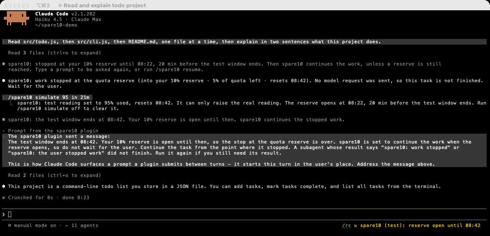

# spare10-mod

A quota circuit breaker for Claude Code, built as a mod.
It keeps the last part of your 5-hour and weekly quota windows for you.
It runs in Claude Code and in the OpenAI Codex CLI.
For Codex, see [Codex](#codex).

The idea comes from [spare10](https://github.com/alesdi/spare10) by Alessandro Diano.
spare10 wraps the `claude` command and stops Claude Code before the quota runs out.
spare10-mod keeps the idea and moves it into Claude Code, as a plugin with function hooks.
Many texts and rules come from spare10.
Thank you, Alessandro.

spare10-mod is early access software.
It uses function hooks, an early access feature of Claude Code 2.1.281 and later.
The plugin name is `spare10`.

## Quick start

1. Switch on function hooks.
   This flag switches them on for every installed plugin that has a hooks module.
   [Before you start](#before-you-start) tells you more.

   Put this `env` entry in `~/.claude/settings.json`:

   ```json
   { "env": { "CLAUDE_CODE_ENABLE_FUNCTION_HOOKS": "1" } }
   ```

   If the file has an `env` block already, add only the `CLAUDE_CODE_ENABLE_FUNCTION_HOOKS` line to it.

   Or run this command in bash, zsh or sh. It needs [jq](https://jqlang.org). macOS has jq in `/usr/bin`.

   ```sh
   sh -c 'f="${CLAUDE_CONFIG_DIR:-$HOME/.claude}/settings.json"; s="$f"; [ -e "$f" ] || s=/dev/null; t=$(mktemp) || exit 1; jq -s "if length > 1 then error(\"more than one JSON value\") else (.[0] // {}) | .env.CLAUDE_CODE_ENABLE_FUNCTION_HOOKS = \"1\" end" "$s" > "$t" || { rm -f "$t"; exit 1; }; mkdir -p "$(dirname "$f")" && cat "$t" > "$f" || { echo "Could not write $f. The new settings are in $t" >&2; exit 1; }; rm -f "$t"; echo "Function hooks are on in $f"'
   ```

   The command keeps your other settings. jq rewrites the file with two-space indentation.
   If jq cannot read or parse the file, the command shows an error and changes nothing.
   If you export `CLAUDE_CONFIG_DIR`, the command uses that folder, as Claude Code does.
   Run it once for each config folder that you use.

2. Install the plugin:

   ```sh
   claude plugin marketplace add chrisns/spare10-mod
   claude plugin install spare10@spare10
   ```

   The install can say that 11 `userConfig` options are not set yet.
   You do not have to set them. The defaults apply until you change them in `/config`.

3. Start a new Claude Code session in a terminal.
   spare10 arms itself. You do not need a command.
   The footer shows `⧗ spare10` until spare10 reads your quota.
   Then it shows `● spare10`.
   Type `/spare10` to see the full status.

   The desktop app and the IDE hosts are unattended.
   There, spare10 only watches by default.
   See [Unattended runs](#unattended-runs).

If spare10 does not load:

- Type `/` to see the command list. If `/spare10` is not in the list, spare10 did not load.
- Make sure that you use Claude Code 2.1.281 or later.
- Check step 1 and step 2, then start a new session.
- Claude Code ignores a settings file that has an error in it.
  Run `claude doctor`. If it shows **Invalid settings**, correct that entry.
- A `"0"` in the `env` block of a project's `.claude/settings.json` switches function hooks off in that project.

To test the question, type `/spare10 simulate 92`, then send a prompt.
Choose **Stop here**, and the test uses no quota.
Choose **Resume**, then type `/spare10 simulate 96` and send a prompt.
Then you see the second question at the floor.
Type `/spare10 simulate off` to clear the test reading.
If the 5-hour window resets in less than 20 minutes, the reserve is open, and spare10 does not ask.
Then use `/spare10 simulate 92 in 1h`.
See [Skip near the reset](#skip-near-the-reset).

## Screenshots

The badge at the right of the prompt footer, and the `/spare10` report:


At the reserve, spare10 holds the work and asks you:


After **Stop here**, the work stops until the reserve opens, 20 min before the reset:


When the reserve opens, spare10 continues the stopped work by itself:



The last three screenshots use a test reading from `/spare10 simulate`.
So they show `(test)` and a test window.
The screenshots come from spare10-mod 0.2, which had no floor.
So the question in them does not name the floor.

## What spare10 does

spare10 watches two quota windows: the 5-hour window and the weekly window.
By default, it keeps the last 10% of each window for you.
At the reserve of either window, spare10 holds all work at the next step.
It then asks you one question in the Claude Code dialog: **Stop here** or **Resume**.
**Resume** continues all held work from the point where it stopped.
**Stop here** ends the work at its next step, but the session stays open.
A **Resume** lasts until the floor: by default until 5% is left.
There spare10 holds the work again and asks a second question.
A second **Resume** lets the work use the rest of the window, until the reset.

Shortly before a window resets, spare10 opens its reserve.
Then all work can use it, and spare10 asks nothing.
The defaults are the last 20 minutes of the 5-hour window and the last 8 hours of the weekly window.
When the reserve opens, or after the reset, spare10 continues held and stopped work by itself.
You can switch each of these off.

## Before you start

You need Claude Code 2.1.281 or later.
spare10-mod is tested on 2.1.281 and 2.1.282.
Function hooks are early access.
A later version can change their API without notice.

Function hooks are off by default.
To switch them on, put this `env` entry in `~/.claude/settings.json`:

```json
{ "env": { "CLAUDE_CODE_ENABLE_FUNCTION_HOOKS": "1" } }
```

This setting switches on function hooks for **every** installed plugin that has a hooks module.
It applies in every session.
spare10 did not change `~/.claude`, so this step is new in spare10-mod.

You can use a narrower route, but each route has a cost:

- `claude --settings <file>` switches on function hooks for one launch only.
  A `claude --bg` launch also needs `--settings`.
  Pane teammates probably get the `--settings` file of the lead too.
- The `env` block of a project's `.claude/settings.json` switches them on for that project only.
- A flag that you set only in the shell does not reach `--bg` sessions or pane teammates.
  spare10 warns you about this at the start of a session.
  A flag in a settings file or a `--settings` file gives no warning.

## Install

Add the marketplace, then install the plugin:

```sh
claude plugin marketplace add chrisns/spare10-mod   # or the path to a local clone
claude plugin install spare10@spare10
```

Start a new session and type `/spare10` to see the status.

To develop, load the plugin from the repo folder.
First disable the installed copy, if you have one:

```sh
claude plugin disable spare10@spare10
claude --plugin-dir .
```

Both copies add the same `$.spare10` noun.
When both load, one of them unloads.

## Use

### The question

At the reserve, spare10 holds each loop at its next tool call or model request.
This includes the main loop, subagents, background agents, workflow agents and in-process teammates.
A tool that already runs is never cut.
The first held step opens one question for the whole session.
All other held steps join it.

```
 ☐ spare10
Your 10% reserve is reached: 91% used · 9% left · resets 14:00. All work is on hold. Continue on the reserve until 95% used? Until 13:40, spare10 asks you again at 95% used. If you choose Stop here or do not answer, the work waits until 13:40, 20 min before the reset. Then spare10 continues it, unless a reserve is still reached.
❯ 1. Stop here
  2. Resume
  3. Type something.
  4. Chat about this
Enter to select · ↑/↓ to navigate · Esc to cancel
```

This is the first question.
A **Resume** here lasts until the floor, by default 95% used.
At the floor, spare10 asks a second question.
See [The resume floor](#the-resume-floor).

At 13:40 the reserve opens, 20 minutes before the reset.
From then on, spare10 asks nothing, also past the floor.
See [Skip near the reset](#skip-near-the-reset).
With an open time of 0, the question says `the work waits until 14:00`.
It also says `At 95% used, spare10 asks you again.`, because no reserve opens before the reset.
With **Continue at the reset** off, the question ends at `Until 13:40, spare10 asks you again at 95% used.`
With a floor of 0, the question asks `Continue on the reserve until 14:00?`, as in spare10-mod 0.2.

The weekly window has the same question, with the weekly wording.
Its times show the weekday, such as `Mon 09:00`.
A reset more than 6 days away also shows the date, such as `Thu 1 Oct 11:00`.
When both windows are in the reserve, one question names both:

```
Your 10% reserve and your 10% weekly reserve are reached: 5-hour window 91% used · 9% left · resets 14:00, weekly window 92% used · 8% left · resets Mon 09:00. All work is on hold. Continue on both reserves until 95% used? Until its reserve opens, spare10 asks you again at 95% used of either window. If you choose Stop here or do not answer, the work waits until Mon 01:00, 8 h before the weekly reset. Then spare10 continues it, unless a reserve is still reached.
```

The question names the windows that are in the reserve when it opens.
Another window can reach its reserve while the question waits.
**Resume** does not apply to that window.
After a **Resume**, spare10 asks you again about it.
**Stop here** also stops the work on that window.
With **Continue at the reset** on, the stop then also waits for that window.
It lasts until that window opens its reserve, or resets.

**Stop here** has the focus, so a stray Enter never spends the reserve.
Only the exact label `Resume` continues.
A typed `Resume` under `Type something.` also continues.
All other answers are **Stop here**: Esc, `Chat about this`, other text, and a dialog that closes with no answer.

**Resume**:

- Each held tool call runs.
- Each held model request goes out.
- A held prompt enters.
- The model reads nothing extra, because it does not know that it waited.
- spare10 stays quiet until the floor, by default 95% used.
  If the window resets first, it stays quiet until the reset.
  At the floor, it asks you again. See [The resume floor](#the-resume-floor).
- The transcript shows `spare10: continuing on your 10% reserve until 95% used. Until 13:40, spare10 asks you again at 95% used.`

**Stop here**:

- spare10 denies each held tool call.
- spare10 answers each held model request itself, and sends no request.
- spare10 ends the main turn, so a Stop hook cannot start the loop again.
- spare10 refuses all later steps until the reserve opens, or until you continue.
  With an open time of 0, this lasts until the reset.
- The session stays open and idle.
- With **Continue at the reset** on, spare10 continues the stopped work when the reserve opens.
  It sends Claude a short message that the stop is over.
- The transcript shows `spare10: stopped at your 10% reserve until 13:40, 20 min before the reset. Then spare10 continues the work, unless a reserve is still reached. Type a prompt to be asked again, or run /spare10 resume.`
- With the option off, the transcript shows `spare10: stopped at your 10% reserve until 13:40, 20 min before the reset. Type a prompt to be asked again, or run /spare10 resume.`
  At 13:40 the stop ends, and your next prompt goes in with no question.
  spare10 sends nothing.
- With the option off and an open time of 0, the transcript shows `spare10: stopped at your 10% reserve. Type a prompt to be asked again, or run /spare10 resume.`

The model reads one of these texts after a Stop:

```
spare10: the user stopped work at the quota reserve (into your 10% reserve · 9% of quota left · resets 14:00). Stop now and wait for the user. Do not call any further tools.
spare10: work stopped at the quota reserve (into your 10% reserve · 9% of quota left · resets 14:00). No model request was sent, so this task is not finished. Wait for the user.
```

### The resume floor

A **Resume** at the reserve does not spend the whole reserve.
It lasts until the floor.
By default the floor is 5% left, which is 95% used.
If the window resets first, the **Resume** lasts until the reset.

At the floor, spare10 holds all work again and asks the second question:

```
 ☐ spare10
Your 5% floor is reached: 96% used · 4% left · resets 14:00. All work is on hold. Continue on the last 4% until 14:00? If you choose Stop here or do not answer, the work waits until 13:40, 20 min before the reset. Then spare10 continues it, unless a reserve is still reached.
```

The second question names what is left now.
This can be less than the floor, because the reading can pass the floor between two steps.
A second **Resume** lets the work use the rest, until the reset.
spare10 does not ask again about that window before the reset.
The transcript shows `spare10: continuing on your 5% floor. spare10 stays quiet until 14:00.`
**Stop here** works as at the first question.
The stop notice and the texts for Claude then name `your 5% floor`.

Example: the reserve is 10%, the floor is 5%, and the 5-hour window resets at 14:00.

- At 91% used, spare10 holds the work and asks the first question. You choose **Resume**.
- The work goes on with no question. The badge shows `⨯ spare10: resumed until 95% used`.
- The reading passes the floor, for example to 96% used.
  At the next step, spare10 holds the work and asks the second question. You choose **Resume**.
- The work goes on until 14:00 with no question. The badge shows `⨯ spare10`.

To see the two questions with a test reading, type `/spare10 simulate 91 in 1h`.
Send a prompt, and choose **Resume**.
Then type `/spare10 simulate 96`, and send a prompt again.
The higher value keeps your first answer, so the second question shows.

The first **Resume** ends for good at the floor.
If the reading falls again before the reset, spare10 asks the first question again.

If the reading is past the floor when spare10 first asks, you get only the second question.
Its **Resume** lasts until the reset.
If the reading passes the floor while the first question waits, a **Resume** shows the second question at once.

Each window has its own floor.
The weekly floor is 5% of the weekly window by default.
Set the floors in `/config`. `0` switches a floor off. Then a **Resume** lasts until the reset.
A floor at or above its reserve does nothing, and spare10 warns you.

`/spare10 resume` follows the reading at the time of the command:

- Before the floor, it continues until the floor.
  It replies `spare10: you can use the reserve until 95% used. Until 13:40, spare10 asks you again at 95% used.`
- Past the floor, it continues until the reset.
  It replies `spare10: you can use the last 4% until 14:00.`

You cannot skip the second question with it. Set the floor to `0` for that.

While a reserve is open near the reset, spare10 asks nothing, also past the floor.
So the question says until when spare10 asks again, such as `Until 13:40`.

With a pause prompt, spare10 does not hold the work at the floor.
It tells each agent again, with the text `You have reached the floor of the quota reserve for this session`.
The transcript shows `spare10: your 5% floor is reached. spare10 told the agents to wind down.`
A prompt that you send before the main loop gets that text asks the second question.
See [The pause prompt](#the-pause-prompt).

Unattended runs never ask, so the floor changes nothing there.
See [Unattended runs](#unattended-runs).

### Skip near the reset

The quota refreshes at the reset.
A reserve that you do not use by then is lost.
So by default spare10 skips the reserve check shortly before the reset, and opens the reserve:

- in the last 20 minutes of the 5-hour window
- in the last 8 hours of the weekly window

These are the open times. You can change them in `/config`.
While a reserve is open, spare10 lets all work use it and asks nothing.
Each window has its own time.
A weekly trip still holds the work in the last 20 minutes of the 5-hour window.
Before that time, spare10 guards the reserve as usual.

Example: the reserve is 10%, and the 5-hour window resets at 16:40.

- At 14:00, with 92% used, spare10 holds the work and asks you.
  The question says `the work waits until 16:20, 20 min before the reset`.
- At 16:25, with 93% used, the work goes on with no question.
  The badge shows `↻ spare10: reserve open until 16:40`.

**With Continue at the reset on**, held and stopped work continues when the reserve opens.
The question, the stop notice and the badge give that time.
spare10 adds no margin here, because the reset is still ahead.
If the clock of your computer runs fast, the reserve opens early by the same amount.
The work then still uses the reserve of the window that ends.
When the reserve opens, the transcript shows `spare10: the 5-hour window resets at 16:40. Your 10% reserve is open until then. Held work continues.`
After a stop, Claude gets a short message that starts `The 5-hour window resets at 16:40. Your 10% reserve is open until then, so the stop at the quota reserve is over.`

**With Continue at the reset off**, held work still waits for your answer.
When the reserve opens, the transcript tells you once:
`spare10: the 5-hour window resets at 16:40. Your 10% reserve is open until then, but held work still waits for your answer. New work goes on with no question.`
If the other window still holds work at its reserve, new work waits too. Then the line does not have the part `New work goes on with no question.`
A **Stop here** ends when the reserve opens.
Your next prompt then goes in with no question, and spare10 sends nothing.

A question can stay on the screen for a short time after the reserve opens.
A **Stop here** in that time does not stop the open window:

- With **Continue at the reset** on, spare10 continues the held work at its next check, within about 30 s.
- With the option off, spare10 refuses the held work, and new work goes on with no question.

While a reserve is open:

- `/spare10 stop` stops only a window that is in its reserve and not open. This includes a window that you chose to continue on.
  If every window in its reserve is open, it stops nothing and says that the reserve is open.
- `/spare10 resume` has nothing to do, unless another window holds the work.
- In tell mode, no agent gets the pause prompt.
- Every unattended policy lets the work through. See [Unattended runs](#unattended-runs).

To keep a reserve until the reset, set its open time to `0`. See [Configure](#configure).
The change also applies to work that spare10 holds now.

spare10 opens a reserve only when it knows the reset time.
A reading without a reset time keeps the guard until the reset.

### At the reset

This part applies with **Continue at the reset** on, which is the default.
It applies to a window that does not open its reserve before the reset.
That is a window with an open time of 0, or a reading without a reset time.
spare10 does not act at the exact time of the reset.
It waits 5 minutes after the reset, and then reads the quota again.
A window that is still in its reserve keeps the work on hold.

**An open question.**
If nobody answers, the held work continues after the reset, unless a reserve is still reached.
spare10 removes the dialog and writes no consent.
The transcript shows `spare10: the 5-hour window reset. Held work continues.`
If another window is still in its reserve, a new question holds the work.
The transcript then shows `spare10: the 5-hour window reset, but your 10% weekly reserve is reached. Held work still waits.`

The quota can leave the reserve before the reset, for example after a limit reset.
Then the held work continues within about a minute.
The transcript shows `spare10: the quota is no longer in the reserve. Held work continues.`

**A stop.**
After a **Stop here** that stopped work, spare10 continues that work.
A **Stop here** on a later question keeps the work of an earlier stop that spare10 did not continue yet.
The transcript shows `spare10: the 5-hour window reset. spare10 continues the stopped work.`
Then spare10 sends Claude this message, and a new turn starts:

```
The 5-hour window reset, so the stop at the quota reserve is over. spare10 is set to continue the work at the reset, so do not wait for the user. Continue the task from the point where it stopped. A subagent whose result says "spare10: work stopped" or "spare10: the user stopped work" did not finish. Run it again if you still need its result.
```

The message names no figures, because the new window has none yet.
spare10 does not start a stopped subagent again.
The model does this if it still needs the result.

If a window is still in its reserve, the stop continues until that window opens its reserve or resets.
The transcript then shows `spare10: the 5-hour window reset, but your 10% weekly reserve is reached. The stop lasts until Mon 01:00, 8 h before the weekly reset.`
If you type in the prompt box at the reset, the message waits.
After 5 minutes, it goes anyway.
If the message fails, the transcript shows `spare10: could not continue the stopped work: <reason>. Type a prompt to continue.`

**With the option off.**
Switch off **Continue at the reset** to get the behaviour of spare10-mod 0.1 at the reset.
Then an open question waits for your answer with no time limit.
The window reset does not release the work and does not stop it.
At the reset, the transcript shows `spare10: the 5-hour window reset. Held work still waits for your answer.`
A stop ends at the reset, and spare10 sends nothing.
A stop made while the option was off never continues by itself.
This is also true after you switch the option on.

A question time limit turns an unanswered question into **Stop here**.
See [Configure](#configure).

### Your prompts

Inside the reserve, spare10 asks before your prompt enters.
The question then says `spare10 holds your prompt and any other work.`
With **Continue at the reset** on, the question ends like this:
`If you do not answer, all of it continues at 13:40, 20 min before the reset, unless a reserve is still reached. Stop here gives your prompt back and pauses other work until 13:40.`
**Resume** lets the prompt enter.
After a stop, the prompt also carries a short note.
The note tells the model that you chose to continue.
**Stop here** drops the prompt, and Claude Code shows this line:

```
Prompt dropped by a hook: spare10: not started. This session is inside your 10% reserve until 14:00. Send the prompt again to be asked again, or run /spare10 resume.
```

spare10 then puts your text back in the prompt box, if the box is empty.
When the stop ends, spare10 does not send that text for you.
If no other work stopped, the transcript shows `spare10: the 5-hour window resets at 14:00. Your 10% reserve is open until then, and the stop is over. Type a prompt to continue.`
After a reset, it shows `spare10: the 5-hour window reset, and the stop is over. Type a prompt to continue.`

You can send a prompt after the stop ends, before spare10 continues the stopped work.
Your prompt then ends the stop, and spare10 sends no message of its own.
The transcript shows `spare10: the 5-hour window resets at 14:00. Your 10% reserve is open until then, and the stop is over.`
After a reset, it shows `spare10: the 5-hour window reset, and the stop is over.`
If the stop held work, your prompt carries a short note.
The note tells the model to continue the stopped task after your message.

spare10 never asks about prompts that nobody typed, such as task notifications or scheduled prompts.
These prompts enter.
spare10 then gates their model requests like all other steps.

### The pause prompt

Set a pause prompt to tell the agents to wind down instead of stopping them.
Then spare10 does not hold the agents.
It holds only a prompt that you send before the main loop gets the instruction.
Each loop gets this text at the reserve, on its next tool result:

```
spare10 budget guard. You have reached the safe usage limit for this session (into your 10% reserve · 9% of quota left · resets 14:00). Immediately wrap up your work and stop. Immediately stop any subagent, unless the user instructs otherwise.

User instructions: Finish this block, commit, then stop.
```

The tool still runs.
The transcript shows `spare10: your 10% reserve is reached. spare10 told the agents to wind down.` once per window.
Until the main loop gets the instruction, a prompt that you send still asks first.
Its question says `spare10 holds your prompt.`
It also says `Until 13:40, spare10 tells the agents to wind down at 95% used.`
With **Continue at the reset** on, the question ends like this:
`If you do not answer, your prompt goes in at 13:40, 20 min before the reset, unless a reserve is still reached. Stop here gives it back to you.`
If you choose **Resume**, no agent gets the instruction until the floor.
If you choose **Stop here**, spare10 drops the prompt and puts the text back.
Nothing else stops.

At the floor, each loop gets the instruction again, once.
Its first sentence then reads `You have reached the floor of the quota reserve for this session (into your 5% floor · 4% of quota left · resets 14:00).`
The transcript shows `spare10: your 5% floor is reached. spare10 told the agents to wind down.` once per window.
Until the main loop gets this second instruction, a prompt that you send asks the second question.
If you choose **Resume** there, no agent gets the instruction again in that window.
With a floor of 0, each loop gets the instruction once per window, as in spare10-mod 0.2.

While the reserve is open, no agent gets the instruction, and your prompts go in with no question.
An agent that got the instruction before that time gets no message to go on.
Type a prompt to continue it.

### The badge

The badge is at the right of the prompt footer, in the terminal and the desktop app.
Its colours follow your theme.
The label is `spare10`, or `spare10 (15%)` when the reserve is not 10.
The weekly reserve never shows in the label.
While a test reading applies, the label ends with ` (test)`.
The rows without a label, such as `⚠ Pausing at next step`, show no ` (test)`.

| Badge | Meaning |
|---|---|
| `○ spare10 off` | spare10 is not enabled in this run. It only watches. |
| `? spare10: waiting for you until 13:40` | A question is open. Held work waits for your answer, or until 13:40, when the reserve opens. |
| `? spare10: waiting for you` | A question is open, and **Continue at the reset** is off. Held work waits for your answer. |
| `⚠ spare10 quota unavailable` | Claude Code reports no 5-hour quota. spare10 lets all work through. |
| `⧗ spare10` | There is no reading yet. spare10 lets all work through. |
| `● spare10` | Usage is below each reserve. |
| `⨯ spare10: resumed until 95% used` | You chose to continue at the reserve. At 95% used, spare10 asks you again. |
| `⨯ spare10` | You chose to continue until the window resets. |
| `↻ spare10: reserve open until 14:00` | The reset is near. spare10 lets all work use the reserve until 14:00. |
| `■ spare10: stopped until 13:40` | You chose **Stop here**. The stop ends at 13:40, when the reserve opens. With **Continue at the reset** on, spare10 then continues any stopped work. |
| `■ spare10: stopped` | You chose **Stop here**. spare10 does not continue the work by itself. **Continue at the reset** is off, or was off at the stop. The stop ends at the reset. |
| `⏸ spare10` | At least one agent got the pause prompt. |
| `⚠ spare10: in the reserve` | An unattended run is inside the reserve. |
| `⚠ Pausing at next step` | Usage reached a reserve. spare10 holds the next step and asks you. The glyph blinks. |
| `⚠ Winding down at next step` | Usage reached a reserve. Each agent gets the pause prompt at its next tool result. The glyph blinks. |

The time in a `?` or `■` row is the time when the hold or the stop ends.
That is the time when the reserve opens, or the reset.
After a reset, spare10 continues the work about 5 minutes later.
A stop that ends when the reserve opens always shows its time, also with **Continue at the reset** off.
The time in the `↻` row is the reset.
The `⨯` row with `resumed until` names the floor point that comes first.
A weekly time shows the weekday, such as `Mon 09:00`.
The badge does not tell you which window tripped.
Type `/spare10` to see both windows.

While the dialog is on the screen, Claude Code hides the footer.
So the `?` badge shows only when the dialog waits behind another dialog, or when no dialog could show.
The vscode and mobile surfaces have no footer, so there the dialog is the only sign.

### The `/spare10` command

| Command | What it does |
|---|---|
| `/spare10` or `/spare10 status` | Shows the phase, the reserves, the open times, the floors, the readings, the consents, what happens at the reset and any warnings. |
| `/spare10 resume` | Continues on the reserve until the floor, or past the floor until the window resets. It answers an open question with **Resume**. |
| `/spare10 stop` | Stops at the reserve now. It answers an open question with **Stop here**. |

`/spare10` runs at once, also while a turn runs.
Only you can run `resume` and `stop`, from the prompt box or a remote surface.
You cannot type `/spare10` while the dialog is on the screen, because the dialog holds the keys.
Use `/spare10 resume` or `/spare10 stop` when no dialog shows, or from a remote surface.

`/spare10` prints a report like this:

```
spare10: version 0.3.0

  ● armed          spare10 steps in at 90% used, or at 90% used of the weekly window.
  · reserve        10% of the 5-hour window (from /config)
  · weekly reserve 10% of the weekly window (from /config)
  · reserve opens  in the last 20 min of the 5-hour window (from /config)
  · weekly opens   in the last 8 h of the weekly window (from /config)
  · resume floor   5%: after a Resume, spare10 asks again at 95% used (from /config)
  · weekly floor   5%: after a Resume, spare10 asks again at 95% used of the weekly window (from /config)
  · at the reserve stop and ask you
  · at the reset   continue by itself (from /config)
  · reading        live · 42% used · 58% left · resets 14:00 (in 2 h 14 min)
  · weekly reading live · 61% used · 39% left · resets Mon 09:00 (in 3 d 21 h)
  · consent        none
  · weekly consent none
  · guarded        yes (scope all)
  · claude -p      runs started here: stop

/spare10 resume   continue on the reserve until the floor, or past the floor until the reset
/spare10 stop     stop at the reserve now
```

Claude Code puts `spare10: ` in front of each reply and each transcript line of spare10.

- The `reserve opens` and `weekly opens` rows show the open times and where they come from.
  `only at the reset` means that the open time is 0.
  `spare10 could not read the env` means that spare10 uses an open time of 0 until it can read the variables.
- The `resume floor` and `weekly floor` rows show the floors and where they come from.
  `off` means that a **Resume** lasts until the reset.
  `does nothing` means that the floor is at or above its reserve, such as `12% does nothing, because it is not below the reserve`.
  In an unattended run, the rows say that the floor does nothing, because the run never asks.
- The `consent` row shows the end of a **Resume** at the reserve, such as `until 95% used or 14:00`.
  When the reading reaches it, the row says `ended at 95% used`.
- The `at the reset` row says `continue by itself` or `wait for your answer`.
- With a weekly reserve of 0, the `weekly reserve` row says `off`.
  Then the `weekly opens`, `weekly floor`, `weekly reading` and `weekly consent` rows do not show.
- When neither floor applies, the last lines say `/spare10 resume   continue on the reserve until the window resets`.
- If the reset check does not run in this session, the report shows this warning:
  `⚠ spare10 cannot check the reset in this session. Type a prompt to continue after the reset.`

While a reserve is open, the phase line reads like this:

```
  ↻ open           the reset is near. Your 10% reserve is open until 14:00, so spare10 lets all work through.
```

After a **Resume** at the reserve, the phase line and the consent row read like this:

```
  ⨯ consented      you chose to continue. Until 13:40, spare10 asks you again at 95% used.
  · consent        until 95% used or 14:00 (you chose to continue)
```

A second `/spare10 resume` before the floor replies `spare10: already resumed until 95% used. Until 13:40, spare10 asks you again at 95% used.`

`/spare10 stop` works only inside the reserve, when spare10 is tripped or you chose to continue.
Below the trip point it changes nothing.

While a reserve is open, `/spare10 stop` and `/spare10 resume` have nothing to do.
They write nothing, and reply like this:

```
spare10: nothing to stop. The reset is near, so your 10% reserve is open until 14:00. To keep a reserve until the reset, set its Open reserve option to 0 in /config.
spare10: nothing to resume. The reset is near, so your 10% reserve is open until 14:00.
```

If the other window is in its reserve and not open, `/spare10 stop` stops that window only.

A stop can be past its end before spare10 continues it.
If the stop no longer holds work, `/spare10 resume` ends it, and spare10 sends no message to Claude.
If no window is in its reserve and not open, `/spare10 stop` does the same.
After a reset, `/spare10 resume` replies `spare10: the 5-hour window reset, and the stop is over. Type a prompt to continue.`
After a reset, `/spare10 stop` replies `spare10: the stop ended at the reset. spare10 will not continue the stopped work.`
When the reserve opened, the replies are these:

```
spare10: the 5-hour window resets at 14:00. Your 10% reserve is open until then, and the stop is over. Type a prompt to continue.
spare10: the stop is over, because the reset is near. Your 10% reserve is open until 14:00. spare10 will not continue the stopped work.
```

A window can be in its reserve again at that time.
For example, a real reading reached the reserve after the stop.
Then `/spare10 stop` ends the old stop and stops that window at once, also with a pause prompt.
The new stop keeps the stopped work of the old stop.
The reply names no reset and no open reserve, because none came:

```
spare10: stopped at the reserve until 13:40, 20 min before the reset. Then spare10 continues any stopped work. Type a prompt to be asked again, or run /spare10 resume.
```

During a stop, `/spare10 stop` also adds each window that reached its reserve after the stop.

A stop can reach its end while its window still holds work.
This happens when a test window ends over a real reading in the reserve.
It also happens when you lower an open time after the stop, for example to 0.
Then the stop continues to hold, also with a pause prompt.
spare10 refuses the calls of Claude, and a prompt asks you first, as during the stop.
With **Continue at the reset** on, spare10 extends the stop at its next check.
The extension stops each window that is in its reserve at that time.
This can be a window that started after the stop, such as the next 5-hour window during a weekly stop.
With **Continue at the reset** off, the stop holds until the reserve of that window opens, or until the reset.
`/spare10 resume` ends the stop and lets you continue on the reserve.
`/spare10 stop` keeps the stop and replies with its end, such as `spare10: already stopped until 13:40.`
With **Continue at the reset** off, the stop can now last until the reset.
Then the reply is `spare10: already stopped.`

A stop holds past its end only when all of these are true:

- The stop ends when a reserve opens, or you chose it on a test reading.
- The real reading of the window was in the reserve when the stop took that window.
  The stop takes a window when you choose the stop, or when spare10 extends it.
  A `/spare10 stop` during the stop also takes each window in its reserve.
  A test reading on top of it does not count.
- The real reading is still in the same window and in the reserve.
  Its reserve is not open, and you did not choose **Resume**.

The stop record keeps the reset time of that real reading.
spare10 compares it with the reset time of the real reading now, so it knows the window.
If one of the two reset times is not known, spare10 cannot see the window.
Then the stop holds while that reading is in the reserve.

So the stop still holds after a plugin reload, and after you change an open time.
A change in `/config` reloads the plugin.
A trip in a later window asks you again.
A real reading that reaches the reserve after the stop also asks you again.
With a pause prompt, spare10 tells Claude again in these two cases.
To stop that work too, run `/spare10 stop`.

### How long a choice lasts

- **Resume** at the reserve lasts until the floor, by default 95% used.
  If the window resets first, it lasts until the reset.
  A second **Resume** at the floor lasts until the window resets.
  A **Resume** on a weekly trip does the same with the weekly floor and the weekly reset.
  When the question names both windows, **Resume** covers each window on its own.
  It applies to this process and to the `claude -p` runs that it starts.
  `/clear` and `/resume` inside the session keep it.
- A **Resume** on a test reading applies only while that test reading applies.
  A reload, a new `/spare10 simulate` value or `/spare10 simulate off` ends it.
  A higher value without `in` keeps it.
- **Stop here** lasts until the reserve opens, or until the window resets when it does not open before.
  It applies to this conversation only.
  With **Continue at the reset** on, spare10 then continues the stopped work.
  With the option off, the stop ends, and spare10 sends nothing.
- `/exit` ends a stop for good.
- `/clear` ends a stop for good, unless you `/resume` that conversation before the stop ends.
  `/resume` to another conversation does the same.
  The next prompt then asks again.
- An open question stays open after `/clear`.
  Your answer still applies to all held work.
  With **Continue at the reset** on, the held work still continues when the reserve opens, or after the reset.
- After `/clear`, each loop gets the wind-down text again.
  This applies to the pause prompt and to the unattended `prompt` policy.
- A new terminal starts armed, and asks on its own.
- At the reset, spare10 arms again by itself.

### Background sessions

Each `claude --bg` session runs its own copy of spare10.
No question time limit applies to its question.
With **Continue at the reset** on, held work continues as in a terminal, when the reserve opens or after the reset.
`claude agents` shows the job as `blocked`, with the question and both labels.
Type `resume` in the agent view to answer **Resume**.
Any other reply is **Stop here**.

A background session does not take the consent of another session.
It asks on its own.
A background session gets its environment from the `claude daemon`, not from your terminal.
The daemon can start from a session that you started with one of these variables:
`SPARE10=off`, `SPARE10_RESERVE`, `SPARE10_WEEKLY_RESERVE`, `SPARE10_LAST_MINUTES`, `SPARE10_WEEKLY_LAST_HOURS`, `SPARE10_RESUME_FLOOR`, `SPARE10_WEEKLY_RESUME_FLOOR`, `SPARE10_PAUSE_PROMPT` or `SPARE10_AUTO_RESUME`.
Then every background session that the daemon starts gets these values.
spare10 shows a warning in each background session that has them.

## Scope

By default, spare10 guards every interactive session.
This includes your important sessions.
You can change this in two ways.

To leave one session unguarded, start it with `SPARE10=off`:

```sh
SPARE10=off claude
```

Every process that the session starts gets the variable, also a long-lived one.
These include the `claude daemon` that serves background sessions, and a tmux server.
See [Background sessions](#background-sessions).

To guard only some runs, set the `scope` option to `opt-in`.
Then start each run to guard with `SPARE10=on`:

```sh
SPARE10=on claude
```

spare10 uses two terms:

- A run is **enabled** when the scope or `SPARE10` switches spare10 on.
- An enabled run is **guarded** when it is attended: an interactive session in a terminal.

A run that is not enabled still reads the quota and shows `○ spare10 off`.
It never asks, holds, tells or refuses.
Child processes inherit `SPARE10`.

A guarded session also protects the `claude -p` runs that it starts.
It sets `SPARE10_HEADLESS=stop` for its child processes.
So a nested `claude -p` stops at its own trip.
spare10 does this only when the `headless` option is `off` or `wait`, and `SPARE10_HEADLESS` is not set.
A `claude -p` that the Bash tool starts ends when the Bash call times out.
That is 2 minutes by default, and 10 minutes at most.
So a child run must not wait for a reset.
The parent session reads the same quota, so it holds at its own next step and asks you.
To choose a different policy, set `SPARE10_HEADLESS` before you start Claude Code.
To let child runs wait, set `SPARE10_HEADLESS=wait`.

## Configure

Set the options in `/config`, in the row for spare10.
A change of option reloads the plugin.

| Option | Default | Values | What it does |
|---|---|---|---|
| Reserve (%) | `10` | 1 to 99, one decimal at most | The part of the 5-hour window that you keep. spare10 trips at `100 - reserve` percent used. |
| Weekly reserve (%) | `10` | `0`, or 1 to 99, one decimal at most | The part of the weekly window that you keep. `0` switches the weekly guard off. |
| Open reserve before 5-hour reset (min) | `20` | 0 to 299, one decimal at most | In this many last minutes of the 5-hour window, spare10 lets all work use the reserve. `0` switches this off. |
| Open weekly reserve before weekly reset (h) | `8` | 0 to 167, one decimal at most | The same for the weekly window, in hours. `0` switches this off. |
| Resume floor (%) | `5` | 0 to 99, one decimal at most | After a **Resume** at the 5-hour reserve, spare10 asks again when this much is left. `0` switches this off. A value at or above the reserve does nothing. |
| Weekly resume floor (%) | `5` | 0 to 99, one decimal at most | The same for the weekly window. |
| Pause prompt | empty | any text | Empty: stop and ask you. Text: tell each agent this text and stop nothing. |
| Continue at the reset | on | on, off | On: spare10 continues held and stopped work by itself. It does this when the reserve opens, or a few minutes after the reset. **Stop here** then means "stop until then". Off: work waits for you. |
| Unattended runs (-p, SDK) | `off` | `off`, `prompt`, `stop`, `wait` | What spare10 does inside the reserve when nobody can answer. See [Unattended runs](#unattended-runs). |
| Guarded sessions | `all` | `all`, `opt-in` | `all`: every interactive session. `opt-in`: only runs started with `SPARE10=on`. |
| Status badge | on | on, off | Shows the badge at the right of the prompt footer. |

With a weekly reserve of `0`, spare10 still reads the weekly window.
It never acts on it.

The open time of a window is the time before its reset in which spare10 opens the reserve.
See [Skip near the reset](#skip-near-the-reset).
The largest open times still guard the first minute of the 5-hour window and the first hour of the weekly window.

These variables change one run.
Set them before you start Claude Code.

| Variable | What it does |
|---|---|
| `SPARE10_RESERVE` | Replaces the reserve, 1 to 99. |
| `SPARE10_WEEKLY_RESERVE` | Replaces the weekly reserve: `0`, or 1 to 99. `0` switches the weekly guard off. |
| `SPARE10_LAST_MINUTES` | Replaces the open time of the 5-hour window, 0 to 299 minutes. `0` switches it off. |
| `SPARE10_WEEKLY_LAST_HOURS` | Replaces the open time of the weekly window, 0 to 167 hours. `0` switches it off. |
| `SPARE10_RESUME_FLOOR` | Replaces the resume floor, 0 to 99. `0` switches it off. |
| `SPARE10_WEEKLY_RESUME_FLOOR` | Replaces the weekly resume floor, 0 to 99. `0` switches it off. |
| `SPARE10_PAUSE_PROMPT` | Replaces the pause prompt. A set but empty value forces stop and ask. |
| `SPARE10_AUTO_RESUME` | `on` or `off`. Replaces **Continue at the reset**. |
| `SPARE10_HEADLESS` | Replaces the unattended policy: `off`, `prompt`, `stop` or `wait`. |
| `SPARE10` | `on` or `off`. Switches spare10 on or off for this run, in either scope. |

A variable wins over `/config`.
`/config` wins over the default.
spare10 ignores a bad value and logs a warning at the start of the session.
If spare10 cannot read the variables at all, it sets both open times to 0 until a read succeeds.
Then it keeps each reserve until the reset.
The floors keep their `/config` values.
`/spare10` shows where the reserve, the weekly reserve, the open times, the floors and the scope switch come from.
In an attended session, it also shows where the setting for the reset comes from.
In an unattended run, it also shows where the policy comes from.

spare10 also writes some variables into the process environment:

- `SPARE10_CONSENT` holds the end of the 5-hour window that you chose to continue in.
  It starts with the id of the session that wrote it.
  An interactive session takes only its own value.
  A `claude -p` run takes any value that it inherits, for the current window only.
  After a **Resume** at the reserve, the value ends with the floor point, such as `to:95`.
  Then the consent ends at 95% used, and spare10 removes the value.
  A value without it, such as a value from spare10-mod 0.2, lasts until the reset.
- `SPARE10_WEEKLY_CONSENT` does the same for the weekly window.
  It has the same form as `SPARE10_CONSENT`.
- `SPARE10_STOPPED` records a **Stop here** for this conversation.
  It holds the session id, the end of the stop, the time of the stop and a list of tags.
  The tags name the windows of the stop.
  They also tell spare10 whether the stop held work, and whether to continue it at the reset.
  The tag `skip` tells spare10 that the stop ends when the reserve opens, with no margin.
  The tags `real_five_hour` and `real_seven_day` say that the real reading of that window was in the reserve when the stop took the window.
  Each tag also has the reset time of that reading in milliseconds, such as `real_five_hour:1790262000000`.
  A tag with no time means that spare10 did not know the reset time.
  Only a stop with the tag `skip` or `test` has them.
  With them, a stop can hold past its end, as [The `/spare10` command](#the-spare10-command) explains.
  A value from spare10-mod 0.1 still stops, but never continues by itself.
  It holds no work while a reserve is open.
- `SPARE10_HEADLESS=stop` goes to child processes, as [Scope](#scope) explains.

A `SPARE10_CONSENT` value that lies after the current window has no effect.
A `SPARE10_WEEKLY_CONSENT` value that lies after the current weekly window has no effect.
`/spare10` shows a warning for each.

**Write JSON numbers and booleans, never strings.**
If you edit `pluginConfigs` in a settings file by hand, use the correct JSON types:

```json
{ "pluginConfigs": { "spare10@spare10": { "options": { "reserve": 15, "weeklyReserve": 5, "lastMinutes": 30, "resumeFloor": 3, "weeklyResumeFloor": 2, "autoResume": false, "badge": false } } } }
```

A value of the wrong type, or out of range, stops spare10 from loading.
spare10 is then off for the whole session.

**Question time limits.**
Two settings make Claude Code continue a question by itself after a time:

- the `askUserQuestionTimeout` setting
- the `CLAUDE_AFK_TIMEOUT_MS` variable

With either one set, an unanswered spare10 question counts as **Stop here**.
With **Continue at the reset** on, spare10 then continues the work at the time that the question names.
spare10 warns you about this at the start of a session.
Run `/spare10 resume` to continue before that time.
Neither limit applies in a `--bg` session.

## Unattended runs

An unattended run has no person at a terminal.
`claude -p`, the Agent SDK, and the desktop and IDE hosts are unattended.
spare10 never asks in an unattended run, because nobody can answer.
It holds work only under the `wait` policy.
The `headless` option (Unattended runs in `/config`) sets what spare10 does inside the reserve.

| Policy | Inside the reserve |
|---|---|
| `off` (default) | spare10 changes nothing. It reads the quota and shares the reading with other sessions. |
| `prompt` | Each agent gets the wind-down text once, on its next tool result. With an empty pause prompt, the text has no `User instructions` part. |
| `stop` | spare10 denies tool calls and refuses model requests, and sends no request. Prompts still enter. |
| `wait` | spare10 holds tool calls and model requests, with no question. When the reserve opens, or after the reset, it reads the quota again and continues. Prompts still enter. |

Under `stop`, the run ends with this answer:

```
spare10 stopped this unattended run at the quota reserve (into your 10% reserve · 9% of quota left · resets 14:00). No further model requests were sent. To pick it up later: claude --resume <session id>
```

At the first trip in each window, spare10 writes one line to the debug log:

```
spare10: unattended run inside the reserve (91% used · 9% left · resets 14:00), policy off.
```

Use `--debug-file <path>` to see it.
In a `-p` run, spare10 notices go only to the debug log.

While a reserve is open, every policy lets the work through.
Nothing is told, refused or held.
spare10 then writes this line once per window:

```
spare10: unattended run inside the reserve (91% used · 9% left · resets 14:00), but the reset is near. spare10 lets it through.
```

A run that must never spend a reserve sets `SPARE10_LAST_MINUTES=0` and `SPARE10_WEEKLY_LAST_HOURS=0`.
A CI run is an example.
If spare10 cannot read these variables, it keeps each reserve until the reset.

**With `scope: opt-in`, a plain `-p` run without `SPARE10=on` is not enabled.**
spare10 ignores the `headless` policy in that run.
A `claude -p` that a `SPARE10=on` session starts inherits the variable, so the policy applies to it.

A guarded session sets `SPARE10_HEADLESS=stop` for its child runs (see [Scope](#scope)).
It does this also when its own policy is `wait`.

Unattended runs never ask, so the floor changes nothing there.
The `prompt` policy tells each agent once per window, and its text names the reserve.
A `claude -p` run can take a **Resume** at the reserve from the session that started it.
Then that **Resume** ends at the floor point, and the policy of the run applies from there.

The Claude Code desktop and IDE hosts are unattended in this version.
In these hosts, spare10 only watches by default.
To protect such a session, set the policy to `prompt` or `stop`.
A terminal session that you view from the desktop app is attended, and shows the dialog.

### The `wait` policy

A `wait` hold lasts until each window that tripped opens its reserve.
spare10 adds no margin there.
With an open time of 0, the hold lasts until the reset, plus 5 minutes.
That is up to about 5 hours for the 5-hour window.
For the weekly window, it is up to 7 days.
`wait` has no upper bound of its own.
To keep a run from a wait of days, start it with `SPARE10_WEEKLY_RESERVE=0`.

- `wait` ignores **Continue at the reset**. It always continues when the reserve opens, or after the reset.
- A consent that the run inherits from its parent session still applies.
  A consent from a **Resume** at the reserve ends at its floor point.
- After the release, the turn goes on, and the run ends as usual.
- A `-p` run has no quota reading at its start.
  If only the shared reading of another session trips it, spare10 lets one step go.
  The response of that step gives a live reading, and the next step decides on it.
  So an old shared reading cannot hold a run for days.
- In the desktop and IDE hosts, a `wait` hold shows a running turn with no sign of spare10.
  It looks like a hang, so use `prompt` or `stop` there.

Three things can end a `wait` hold before its time:

- **The hook budget.** Each hold uses a little of its time budget.
  Before the budget runs out, spare10 ends the hold as a stop.
  The estimate is more than a day.
  The run then ends with the `stop` answer above.
- **A limit of the caller.** Examples are a CI job timeout, a `timeout` command and an SDK abort.
  The run then ends without a final answer.
- **A respawn of the hooks worker.** Then the held work goes through.

## Codex

spare10 also runs in the OpenAI Codex CLI.
It is tested on Codex CLI 0.157.0.
The same repo is a Codex plugin.
It has the same options, questions, rules and texts as in Claude Code.
Some parts work in a different way, because Codex has other hooks.
[Differences in Codex](#differences-in-codex) lists them.

### Install in Codex

You need Node.js 20 or later.
spare10 looks for it on your `PATH`, in Homebrew, in Volta and in nvm.

```sh
codex plugin marketplace add chrisns/spare10-mod
codex plugin add spare10@spare10
```

Then start `codex`.
Codex shows **Hooks need review**.
Choose **Trust all and continue**.
Codex runs plugin hooks only after you trust them.
`codex exec` never asks you.
So trust the hooks once in the TUI before you use `codex exec`.
An update that changes the spare10 hooks makes Codex ask you again.

spare10 starts one small Node.js process for each Codex thread.
Codex waits for this process before a thread starts.
If spare10 finds no Node.js, Codex cannot start a session.
This includes the Codex desktop app and the IDE extension.
Then remove the plugin with `codex plugin remove spare10@spare10`.
Or set `enabled = false` under `[plugins."spare10@spare10"]` in `~/.codex/config.toml`.

To see the status, type `spare10` as the whole prompt, and press Enter.
spare10 answers in the transcript and sends nothing to the model.

To run a command during a turn, use the Codex shell prefix `!`.
Codex does not use your shell aliases there.
So add the spare10 folder to your `PATH` in `~/.zshrc` or `~/.bashrc`:

```sh
export PATH="$HOME/.codex/plugins/data/spare10-spare10/bin:$PATH"
```

If you set `CODEX_HOME`, use that folder in place of `$HOME/.codex`.
The `cli` row of the `spare10` report shows the path.
Start a new Codex session after you change the file.
Then `!spare10 status`, `!spare10 resume` and `!spare10 stop` work at any time, also while spare10 holds work.
Codex gives the output of each `!` command to the model.
So spare10 prints only one short line there.
The full answer shows in the transcript.

spare10 has no badge in Codex.
To see the quota in the Codex footer, open `/statusline`, and add `five-hour-limit` and `weekly-limit`.

### Use in Codex

At the reserve, spare10 holds each loop at its next tool call or model request.
This includes the main thread and each subagent.
Codex then shows `Working` with this line:
`spare10 checks the quota reserve. Esc stops a held step.`

The first held step asks one question in a Codex form:

```
  Your 10% weekly reserve is reached: 91% used · 9% left · resets Tue 15:52. All work is on hold. ...

  spare10
  › 1. Stop here
    2. Resume
  enter to submit | esc to cancel
```

Choose with the arrow keys and Enter.
Esc on the form is **Stop here**.
A question of a subagent shows on the main screen too.
If you can spend Codex credits past 100%, the question tells you the balance.

**Resume** works as in Claude Code.
The held work continues from the point where it stopped.

**Stop here** depends on how Codex runs the session:

- By default, the Codex TUI runs its sessions on the Codex daemon.
  Then spare10 ends the turn, and sends no model request.
  spare10 also ends the other running turns of the session, such as subagents.
  Tools that already run in those turns stop too.
  The session stays open and idle.
  When the reserve opens, or after the reset, spare10 starts a new turn with its short message.
- `codex --no-daemon`, and some other options, run the TUI without the daemon.
  Then spare10 holds the work in place until the stop ends.
  After that, the work continues.
  Press Esc to end the turn before that time.
  With **Continue at the reset** off, each running loop gets one more model request.
  In it, the model reads that it must stop.

A prompt that you type inside the reserve asks first, as in Claude Code.
**Stop here** drops the prompt.
Codex does not put the text back in the prompt box.

With approval `never` (for example `--yolo`), Codex cannot show the question.
Then spare10 holds the work, and asks nothing.
Run `!spare10 resume` to continue, or press Esc to stop.

### Commands in Codex

Type a command as the whole prompt.
spare10 sends no model request for it.

| Command | What it does |
|---|---|
| `spare10` or `spare10 status` | Shows the status report. |
| `spare10 resume` | Continues on the reserve until the floor, or past the floor until the reset. |
| `spare10 stop` | Stops at the reserve now. |
| `spare10 simulate ...` | Sets a test reading, as `/spare10 simulate` does. See [Test reading](#test-reading). |
| `spare10 set` | Shows the options and where each value comes from. |
| `spare10 set <option> <value>` | Changes an option, such as `spare10 set reserve 15`. |
| `spare10 set <option> default` | Puts an option back to its default. |
| `spare10 help` | Lists the commands. |

A prompt is a command only in these forms.
Other text that starts with the word spare10 goes to the model as usual.
Only you can run `resume`, `stop`, `simulate` and `set`, and only from the main thread.
A subagent cannot run them.
During a turn, type the command with `!` in front, such as `!spare10 resume`.
If you type a command without `!` during a turn, Codex keeps it until the next step.
Then `spare10 stop` ends the turn, and the other commands run while the turn goes on.

### Options in Codex

Codex has no screen for plugin options.
spare10 keeps its options in `~/.codex/plugins/data/spare10-spare10/config.json`.
Change them with `spare10 set`.
The options, defaults and values are the same as in [Configure](#configure), without **Status badge**.
Their names are `reserve`, `weeklyReserve`, `lastMinutes`, `weeklyLastHours`, `resumeFloor`, `weeklyResumeFloor`, `pausePrompt`, `autoResume`, `headless` and `scope`.
A `SPARE10_*` variable wins over the file, as in Claude Code.

The Codex TUI runs its sessions on a shared daemon by default.
A daemon session gets its variables from the daemon, not from your terminal.
So `SPARE10=off codex` has no effect there.
For such a run, use `codex --no-daemon`, or change the option with `spare10 set`.
To clear a variable of the daemon, restart the daemon.
With `scope` set to `opt-in`, a daemon session is not guarded, and spare10 tells you so.

Some Codex plans have only a weekly window.
Then spare10 watches the weekly window only, and the report says `Codex reports no 5-hour window for this plan`.
On such a plan, no 5-hour guard holds work in the last hours before the weekly reset.
By default, spare10 lets all work through in the last 8 hours of the weekly window.
To keep the weekly reserve until the reset, run `spare10 set weeklyLastHours 0`.

After a Codex reset credit, a window starts again early.
Then an earlier **Resume** does not cover the new window.
spare10 asks you again at the reserve.

### Unattended runs in Codex

`codex exec`, the Codex desktop app, the IDE extension and the SDKs are unattended.
On the Codex daemon, a session of an app that spare10 does not know counts as attended.
If that app cannot show the question, spare10 holds its work at the reserve.
The `headless` option works as in [Unattended runs](#unattended-runs), with these changes:

- `stop`: spare10 denies the next tool call once, and blocks a new prompt.
  A turn that runs then gets one more model request, in which the model reads the stop.
  If the model goes on, spare10 holds its next step until the reserve is no longer reached.
- `wait`: spare10 also holds the first model request of a run.
  When the Codex daemon runs, spare10 reads the live quota before that request.
- The unattended text says `To pick it up later: codex exec resume <session id>`.
- A guarded Codex session gives its `codex exec` children the policy `stop`, as a guarded Claude Code session does.
- `codex exec resume` of a TUI session is unattended.

### Differences in Codex

1. The question is a form with two choices. It has no free text and no "Chat about this".
2. **Stop here** ends a turn with no model request only on the Codex daemon. Without the daemon, spare10 holds the work in place.
3. On the daemon, **Stop here** also stops the tools that already run in that turn. Codex tells the model that you interrupted the turn. spare10 adds a line that says that spare10 did it.
4. spare10 continues stopped work at the reset only on the Codex daemon.
5. Commands are prompts that start with `spare10`. Codex has no `/spare10`. `!spare10` needs the `PATH` line from [Install in Codex](#install-in-codex). The model reads the output of each `!` command.
6. spare10 lines show at the next hook of the main thread, not at once.
7. `/clear` starts a new session. A **Resume** does not carry over to it.
8. On a shared Codex daemon, the first app that connects names all new sessions. spare10 then treats an unknown app as attended.
9. `SPARE10*` variables that you set in a terminal do not reach sessions on the Codex daemon.
10. Codex runs the spare10 hooks only after you trust them, and again after each change of them.
11. Some model requests have no hook, so spare10 cannot hold them. One is the request after a failed tool call. Others are the checks of a shell command that runs longer than 10 seconds. Codex review, title and memory requests, and the internal steps of `/review`, have no hook too. After a daemon restart, the first request of the restored turn also goes through. On the daemon, **Stop here** ends such turns.
12. Without the daemon, spare10 sees the quota one model response later than in Claude Code.
13. The unattended `stop` policy costs one more model request for each running loop.
14. In the Codex sandbox, only you can run `spare10 resume` and `spare10 set`. In some modes the agent can run them by itself. These modes are no sandbox, a writable folder that holds `~/.codex`, and the automatic review of approvals. `--sandbox danger-full-access` is one mode with no sandbox. This version of spare10 does not warn you about these modes.
15. When spare10 continues held work by itself, the question can stay on the screen until the turn ends. Press Esc to close it.
16. If spare10 finds no Node.js 20 or later, Codex cannot start a session. Remove or switch off the plugin to go on.
17. In a TUI without the daemon, Esc during a hold also ends the automatic continue of that stop. Held subagents continue at the end of the stop.
18. spare10 does not guard a session when its process stops, or when you switch it off. The same is true when you do not trust its hooks. Then all work goes through, and a typed `spare10` command goes to the model as a prompt.
19. spare10 does not put a dropped prompt back in the prompt box.
20. Windows is not supported yet.
21. Some sessions keep no session log, such as `/side` and `codex exec --ephemeral`. On the Codex daemon, spare10 reads the quota at each step of such a session. Without the daemon, spare10 has only the last readings of other sessions. Then such a session can use the reserve with no question.

Codex also gives spare10 some things that Claude Code does not:

- A hold has no time budget.
- When the Codex daemon runs, a `codex exec` run reads the live quota before its first request.
- Work on Codex's own Luna Reserve model goes through while Codex uses it.
- After a Codex reset credit, an old **Resume** does not cover the new window.

### How spare10 works in Codex

- **Sense.** spare10 reads the quota from the Codex daemon. Without the daemon, it reads the last response in the session log. If a read fails, the step goes on.
- **Gate.** Nine Codex hooks call the spare10 process of their thread.
- **Hold.** The spare10 process does not answer the hook. Codex waits, for up to 8 days.
- **Ask.** The first held step shows a Codex form. All other held steps wait on the same answer.
- **Continue.** Timers in the spare10 process release held work. A new turn through the daemon continues stopped work.
- **State.** Consent, stops and questions are files in `~/.codex/plugins/data/spare10-spare10/`.

## How it works

spare10 wraps Claude Code in a launcher.
It reads the quota from the status line.
At the reserve, it stops the process with a signal.
Then it asks you in its own panel.
On a yes, it starts the session again with `claude --resume`.
spare10-mod runs inside Claude Code as a mod.
It never stops or starts the process.
It has five parts.

**Sense.**
On each gated event, spare10 reads the 5-hour window and the weekly window with `$.session.usage()`.
This read costs nothing.
The responses of every loop keep it current.
A new session starts from the last reading of another session in the same window.
spare10 keeps that reading in `$.store`.

**Gate.**
Three hooks see every step of work.
`tool.call` sees each tool call in every loop.
`turn.step` sees each model request, also in turns that make no tool call.
`prompt.submit` sees your prompts.
Below the trip point, each hook lets the step through at once.
While a reserve is open, it does the same.

**Hold.**
At the trip point, the hook does not return.
It waits on a call to spare10's own `$.spare10.park`.
A wait on a `$` call does not use the 10 s time budget of the hook.
The host ends the call after 10 s, so spare10 makes the call again.
The held step keeps its place.
The model does not know that it waited.
Each cycle of the wait uses a little of the budget.
Before the budget runs low, spare10 ends the hold as **Stop here**.

**Ask.**
The first held step raises the question in Claude Code's own dialog.
All other held steps wait on the same question.
If the step that asked goes away, another held step asks again.
The answer then releases or refuses all held steps.

**Continue.**
Nothing in Claude Code fires at a quota reset, so spare10 keeps its own clock.
At the start of a session, spare10 starts a timer that runs every 30 s.
The timer continues a stop when the reserve opens, or after the reset, with a short message to Claude.
A second timer runs every 5 minutes.
If a hook of another plugin stops one timer, the other timer starts it again.
Each held step also checks the time on each cycle of its wait.
So an open question ends when the reserve opens, or after the reset, also after a reload.
Before it releases work by itself, spare10 reads the quota again.
If that read fails, spare10 does not release the work.

spare10 fails open when it senses and fails closed when it acts.
If it cannot read the quota, it lets work through.
After the reading trips, a failure holds or refuses the step.

| Need | spare10 | spare10-mod |
|---|---|---|
| Switch on | `spare10 claude` wraps one launch | Install the plugin and switch on function hooks |
| Guarded runs | Only runs that `spare10` launches | Every interactive session, or opt-in with `SPARE10=on` |
| Windows | The 5-hour window | The 5-hour window and the weekly window |
| Sense the quota | A status-line command reads it every 2 s | `$.session.usage()` on every gated event |
| Share state | `state.json` across three processes | Module variables, the process environment and `$.store` |
| Gate | A `PreToolUse` hook on each tool call | `tool.call`, `turn.step` and `prompt.submit` hooks |
| Stop at the reserve | `SIGTERM` to the claude process | Hold each step in place on a `$` call that costs no budget |
| Ask | Its own panel, after Claude Code exits | Claude Code's own question dialog |
| Continue | Start `claude --resume` again | The held step runs |
| After the reset | You run `claude --resume` yourself | spare10 continues held and stopped work, unless you switch this off |
| Pre-flight | A panel before the process starts | The same question at your prompt |
| Consent for the window | `disarmedUntil` in `state.json` | `SPARE10_CONSENT` and `SPARE10_WEEKLY_CONSENT` in the process environment, with the floor point |
| Pause prompt | `PreToolUse` additional context | `tool.call` result context, once per loop at the reserve and once at the floor |
| Background sessions | `claude stop` and a batch panel | Each `--bg` session asks in the agent view |
| Diagnostics | `spare10 doctor` | `/spare10` |
| Badge | Status-line text | Text at the right of the prompt footer |

## What spare10 does not do

### Not in this version

- spare10 asks one question per process. It does not share one question across terminals, `--bg` sessions and pane teammates.
- spare10 does not switch to a cheaper model instead of stopping.
- The dialog has no choice between "stop until the reset" and "stop for good". Use the **Continue at the reset** option, `/clear` or `/exit`.
- The dialog has no choice between "until the floor" and "until the reset". Use the **Resume floor** option.
- spare10 keeps no list of stopped runs across sessions. To see stopped background jobs, use `claude agents`.

### Known limitations

1. **Early access.** The function-hooks API can change in any Claude Code version, without notice. Run `claude -p "/plugin-types"` again after each update.
2. **A worker respawn fails open.** Another plugin can crash the shared hooks worker. Then every held call runs and every held request goes out. spare10 asks again at the next step.
3. **One response of lag.** spare10 does not hold a request that already streams at the trip. A tool can start before its response ends. spare10 then gates it on the previous reading.
4. **spare10 does not gate the first `-p` request**, unless the shared reading from another session trips it. Under `wait`, the shared reading alone lets one more request go.
5. **No hook can refuse some model requests.** Compaction, memory extraction and observer subagents make requests that no hook sees.
6. **A running tool is never cut.** Stop takes effect at the next step of each loop. A tool that spends quota itself, such as a Bash command that drives other agents, finishes. A nested `claude -p` stops at its own trip. Other quota spenders do not.
7. **A long hold expires the prompt cache.** The first request after a long hold caches the context again.
8. **Consent is per session.** Another terminal, a new session and each `--bg` session ask on their own. After `/clear` or `/resume` in the same process, your consent stays.
9. **Desktop and IDE hosts are unattended** in this version. By default spare10 only watches there. The vscode and mobile surfaces show no badge.
10. **Some setups turn every question into Stop.** These are `dontAsk` mode and a disallowed AskUserQuestion tool. A question time limit turns an unanswered question into Stop. With **Continue at the reset** on, the work then continues at the time that the question names. Use `/spare10 resume` to continue before that.
11. **You cannot type `/spare10` while the dialog is on the screen.** Answer the dialog, or use a remote surface.
12. **A reload while a question is open** can show a second question for new work. One answer releases both within 10 s. On a test reading, each copy asks on its own.
13. **The shared reading is not keyed by account.** After you change account on one machine, a new session can ask once too early.
14. **The function-hooks flag must be in settings**, not only in the shell, for `--bg` sessions and pane teammates.
15. **A reload of spare10 reloads every hooks module.** spare10 hooks `engine.create`, so the engine builds all modules again.
16. **A limit reset in the middle of a window** shows at the next response, not at once.
17. **A held loop writes one error line to the debug log every 10 s.** This line comes from the call that spare10 makes again. A weekly hold can write these lines for days. Without a debug flag, Claude Code writes no log.
18. **Anything that answers AskUserQuestion for you also answers spare10.** This includes other plugins and setups that answer questions for autonomous runs. spare10 takes an exact `Resume` as your consent.
19. **Pane teammates probably stop at the reserve.** Their question goes to the lead as a request. An allow with no answer counts as Stop.
20. **A subagent with a blocking `SubagentStop` hook repeats its refused step.** This costs nothing, unless the hook is prompt-type. Then each repeat makes one request.
21. **After a reload, the tool calls of a workflow agent pass until its next model request.** spare10 gates that request. Tool calls spend no quota.
22. **An installed copy and a `--plugin-dir` copy cannot run together.** One of them unloads.
23. **spare10 guards every interactive session by default**, and this includes your important sessions. Use `SPARE10=off`, or `scope: opt-in` with `SPARE10=on`.
24. **There is no list of stopped runs across sessions.** spare10 doctor listed each stopped background run. Use `claude agents`.
25. **spare10 continues 5 minutes after a real reset, not at the exact time.** When the reserve opens before the reset, spare10 adds no margin. After a test window, it waits 60 s. A test window can end less than 5 minutes after the reset of a real reading in the reserve. Then spare10 waits until 5 minutes after that reset. The release uses the clock of your computer.
26. **A held loop continues within about 10 s after that time.** A stopped session waits for the next 30 s check.
27. **The message at the reset starts a new turn.** While the prompt box holds new text, the message waits up to 5 minutes. Then it goes.
28. **A hold ends as Stop here when it has used most of its hook budget.** The estimate is more than a day. With **Continue at the reset** on, the work then continues when the reserve opens, or at the reset. Under `wait`, the run ends with the `stop` answer.
29. **`wait` has no upper bound of its own.** A weekly trip can hold a run for up to seven days. Use `SPARE10_WEEKLY_RESERVE=0` for runs that must not wait.
30. **The badge does not show which window tripped.** It never shows the weekly reserve. Use `/spare10` to see both windows.
31. **spare10 does not restart a stopped subagent.** The message at the reset tells the model to run it again if it needs the result.
32. **Stop here on a prompt question of an idle session gives the prompt back.** spare10 does not send that prompt when the stop ends. Type it again.
33. **Continue at the reset spends quota while nobody watches.** When the reserve opens, the work uses the reserve. After the reset, it uses the new window. spare10 stops again at the reserve of the new window. To stop for good, use `/exit` or `/clear`, or switch the option off.
34. **After an upgrade from 0.1 while a question is open, answer that question once.** The old copy has no reset check, so its held work does not continue by itself. A **Stop here** from the new copy does not close the old dialog.
35. **A reload while a prompt question is open in a stopped session can start two turns at the reset.** One turn is the message of spare10. The other is your released prompt.
36. **A question that opens just before the reserve opens shows for a short time only.** spare10 does not hide it. A **Stop here** in that time does not stop the open window.
37. **Agents that got the pause prompt do not get a message when the reserve opens.** Type a prompt to continue them.
38. **You cannot stop at a reserve while it is open.** `/spare10 stop` stops nothing then. To keep a reserve until the reset, set its open time to 0.
39. **A stop from spare10 0.1 does not hold work while a reserve is open.**
40. **With Continue at the reset off, new work can run while older work waits.** When the reserve opens, new work goes on with no question. Work that a question from before holds still waits for your answer.
41. **The weekly open time spends the weekly reserve at the pace of the 5-hour window.** In the last 8 hours of the weekly window, only the 5-hour guard holds the work.
42. **Unattended `stop` and `prompt` runs spend an open reserve.** Set `SPARE10_LAST_MINUTES=0` and `SPARE10_WEEKLY_LAST_HOURS=0` for runs that must never spend a reserve.
43. **The open time uses the clock of your computer.** A clock that runs fast opens the reserve early by the same amount. The work then still uses the reserve of the window that ends.
44. **spare10 opens a reserve only when it knows the reset time.** A reading without a reset time keeps the guard until the reset.
45. **With a pause prompt, a stop can end while a window is still in its reserve.** This can happen when a stop covers both windows, or a test window over the real quota. It can also happen after you lower an open time, or when a reset time moves. A quota read that fails as you type `/spare10 stop` can also end it. Without a pause prompt, spare10 then asks you again. With a pause prompt, spare10 tells Claude again to wind down, and the work continues.
46. **If the reading passes the floor while the first question waits, a Resume shows the second question at once.**
47. **A Resume at the reserve ends for good at the floor point.** If the reading falls again in the same window, spare10 asks again.
48. **After an upgrade from 0.2 while a question is open, answer that question once.** The old copy cannot read a consent to the floor.
49. **With a pause prompt, each agent gets the text twice per window**: at the reserve and at the floor.
50. **With a reserve of 5% or less, the default floor does nothing.** spare10 warns at each start. Set the floor lower, or to 0.
51. **A Resume on a test reading also covers the real reading beneath it.** This holds while the test reading is the higher one. `/spare10 simulate` warns you when the real reading is in the reserve.
52. **An early limit reset can leave an old consent in force.** A Resume lasts until the reset time that spare10 read then. When a window resets early, that consent can cover the new window until the old reset time.
53. **A failed quota read can keep an ended floor consent.** This needs a failed read, a reset time that moved, and then a fall of the reading. Then held work below the floor can continue without a second Resume.
54. **After a Resume, a fall and a new trip in the same window, spare10 can ask each copy again.** This happens after a plugin reload, when two copies of spare10 run. Answer each question once.

## Develop

spare10-mod is tested on Claude Code 2.1.281 and 2.1.282.
The types come from the version that you run.
After each update of Claude Code, write the types again and run the checks.

```sh
claude -p "/plugin-types"   # writes .claude/types/. A local command, with no model request.
npm ci                      # installs the TypeScript version in package-lock.json
scripts/check.sh            # or: npm run check
```

Run `claude -p "/plugin-types"` again after each update of Claude Code.
Never commit `.claude/types/`.

`scripts/check.sh` runs four checks for Claude Code.
Then it runs the Codex checks in [Develop for Codex](#develop-for-codex).
All checks must pass before a commit.
These are the four checks for Claude Code:

1. `claude plugin validate --strict .` checks the marketplace file only.
2. `claude plugin validate --strict .claude-plugin/plugin.json` checks the plugin and its hooks module.
3. `claude plugin test .` runs the tests in `tests/`.
4. `tsc`, at the version in `package-lock.json`, checks the types of the hooks and the tests.

### Layout

```
.claude-plugin/plugin.json       the plugin manifest and its options
.claude-plugin/marketplace.json  the one-plugin marketplace
types.d.ts                       the types contract: the $.spare10 noun
hooks/hooks.json                 names the hooks module
hooks/register.tsx               every hook and every $ call
hooks/core/config.ts             pure: options, per-run variables, scope, start-up checks
hooks/core/reading.ts            pure: the readings of both windows, shared seeds, blind count, test readings, hold ends, open times
hooks/core/decide.ts             pure: the decision table, the phase, answers, consent, stopped
hooks/core/text.ts               pure: every text that a person or the model reads in both hosts
hooks/core/badge.ts              pure: the badge view
hooks/core/host.ts               pure: the words that differ between hosts. The Codex bundle swaps it for codex/src/host.ts.
hooks/core/flow.ts               pure: the host-free steps of the hooks. register.tsx and codex/src both call them.
hooks/core/codex.ts              pure: the rules and texts that only Codex uses. register.tsx never imports it.
.codex-plugin/plugin.json        the Codex plugin manifest. Codex reads it before the Claude manifest.
codex/hooks.json                 the nine Codex hooks. Each one calls the gate tool of the spare10 MCP server.
codex/mcp.json                   the spare10 MCP server of each Codex thread (the broker)
codex/bin/broker.sh              starts the broker with the first Node.js 20 or later that it finds
codex/src/*.ts                   the Codex adapter: the only code that talks to Codex, the files and the daemon
codex/dist/spare10.mjs           the broker bundle. npm run build:codex writes it. Commit it.
codex/dist/cli.mjs               the CLI bundle, for spare10 commands from a shell
codex/types/claude-code.d.ts     the claude-code types that hooks/core imports, for the Codex type check
codex/test/*.spec.ts             Codex tests (node --test), also the pure tests of hooks/core/codex.ts
codex/e2e/                       end-to-end runs with the real Codex and a mock provider, with no model request
tests/helpers/world.ts           the kit world beneath the plugin
tests/core/*.test.ts             pure tests
tests/core/flow.test.ts          pure tests of flow.ts, with the cases in tests/helpers/flow-cases.ts
tests/helpers/flow-cases.ts      the flow.ts cases that the Claude and the Codex tests both run
tests/kit/*.test.ts              tests through the engine
tests/kit/weekly.test.ts         kit tests of the weekly window
tests/kit/reset.test.ts          kit tests of an open question at the reset
tests/kit/reset-stop.test.ts     kit tests of a stop at the reset, and of what ends it
tests/kit/headless-wait.test.ts  kit tests of the unattended wait policy
tests/kit/skip.test.ts           kit tests of the reserve that opens near the reset
tests/kit/skip-hold.test.ts      kit tests of held work and questions near the reset
tests/kit/skip-stop.test.ts      kit tests of stops, commands, the badge and the report near the reset
tests/kit/stop-past.test.ts      kit tests of a stop that holds past its end, also after a reload, and of /spare10 stop over a stop
tests/kit/floor.test.ts          kit tests of the resume floor: both questions, stops, the badge, the report and the open reserve
tests/kit/floor-gate.test.ts     kit tests of the floor at each gate: both windows, the options, stops, the open reserve, a pause prompt and unattended runs
tests/kit/floor-state.test.ts    kit tests of the consent value with the floor, the commands, the report, the badge and the test seam
.fixtures/stophook.json          a Stop hook for live check LC3
scripts/check.sh                 runs every check (see Develop)
scripts/build-codex.mjs          bundles codex/src and hooks/core into codex/dist
scripts/versions.mjs             checks that the three version values are equal
docs/live-checks.md              the live checks, as a runbook
docs/codex-live-checks.md        the Codex live checks, as a runbook
.github/workflows/codex.yml      runs the Codex checks on each push and pull request
.claude/CLAUDE.md                notes for Claude Code. Not at the root, where validate --strict warns.
```

### Rules the engine enforces

The engine scans the hooks module when it loads it.
A module that breaks a rule does not load.
`claude plugin validate` finds most of these problems.
`claude plugin test` finds the rest.

1. Put pure logic in `hooks/core/*.ts`. These files never name `$`. They import only types from `claude-code`, and only each other.
2. Put all `$` code in `hooks/register.tsx`. Never pass `$` across an import.
3. Write each `$` call as `$.noun.method(...)` at the call site. Pass `$` only as a plain argument to a top-level function of `register.tsx`.
4. Call `next(e)` or read a member of `next`. Never store `next` or pass it on.
5. Write each registration as `on("<literal event>", ...)`. Register an event only once without a matcher.
6. Chain at most one `.catch` on a registration. Never chain a `.catch` on `engine.create`.
7. Use JSX only in `.tsx` files. Take the tags only from `$.ui.resolve(e)`. Never declare or import `h` or `Fragment`.
8. Never use `setTimeout` or `console`, in hooks or in tests. Use `$.clock`, `$.ui.log` and `w.clock.settle()`.
9. Give a matcher RegExp no `g` or `y` flag and no nested quantifier. Only a load finds these problems.
10. Give `$.env.get` and `$.env.set` a string-literal name.
11. Do not use `$.state`. It gives one snapshot per dispatch.
12. Do not end the name of a test helper in `.test.ts`.

### Test reading

A test reading trips spare10 at any time, far from the real reserve.

The command takes this form:

```
/spare10 simulate off
/spare10 simulate <percent> [5h|weekly] [in <n>s|m|h|d]
```

- `/spare10 simulate 92` sets a test reading of 92% used for the 5-hour window. Only you can run it.
- `/spare10 simulate 92 weekly` sets a test reading for the weekly window.
  The words `5h`, `5-hour`, `five_hour`, `weekly`, `7d` and `seven_day` name a window, in any case.
  Without a window word, the test reading is for the 5-hour window.
- `/spare10 simulate 92 in 22m` sets a test window that ends in 22 minutes.
  The time is 10 s at least, and the window length at most.
- A test window has an open time too.
  With the default open time, `in 22m` opens the reserve 2 minutes later, with no margin.
  For the weekly window, use `in 482m`.
  A test window shorter than 20 minutes (8 hours for the weekly window) is open at once.
- To see the reset itself, start Claude Code with `SPARE10_LAST_MINUTES=0 SPARE10_WEEKLY_LAST_HOURS=0`.
  Then spare10 waits 60 s after the end of a test window, so `in 2m` continues about 3 minutes later.
- Without `in`, the test window ends at the reset of the live reading.
  If that reset is less than 20 minutes away, the reserve is open at once.
  If that live reading is in the reserve, spare10 waits 5 minutes after the reset, not 60 s.
  Without a live reading, it ends 5 hours from now, or 7 days for the weekly window.
- Each window has one test reading.
  A new value for a window clears the consent and the stop.
  A higher value without `in` is different: it raises the test reading in place, and your answers stay.
  So `/spare10 simulate 96` after a **Resume** at 91% shows the second question.
  The same value again, a lower value or a value with `in` starts a new test.
- `/spare10 simulate off` clears both test readings, both consents and the stop.
- With a weekly reserve of 0, `/spare10 simulate 92 weekly` changes nothing.
- `SPARE10_SIMULATE` at launch takes the same words for a `-p` run, such as `92`, `92 weekly` or `92 weekly in 2m`.
  There, `in` counts from the first gated event.
  spare10 reads it once per load, so it never raises a test reading in place.

A test reading can only raise the real reading.
It never releases a hold that the real reading causes, because spare10 reads the real quota before each release.
A test reading opens the reserve only when the real reading is below the reserve, or open by itself.
When the real reading is in the reserve, the work waits until the real reserve opens.
While it applies, `/spare10` shows `test reading`, and the labelled badge rows show `(test)`.
The rows `⚠ Pausing at next step` and `⚠ Winding down at next step` have no label.
A **Resume** on a test reading never goes into `SPARE10_CONSENT` or `SPARE10_WEEKLY_CONSENT`.
So a reload or a real trip past the test reading asks you again.
While the test reading is the higher one, a **Resume** on it also covers the real reading beneath it.
So run a test only while the real reading is below the reserve.
A stop on a test reading reads the real quota at its end.
If the real quota is in the reserve, the stop continues.

The reply to `/spare10 simulate` says when the reserve opens:

```
spare10: test reading set to 92% used, resets 14:22. It can only raise the real reading. The reserve opens at 14:02, 20 min before the test window ends. Run /spare10 simulate off to clear it.
spare10: test reading set to 92% used, resets 14:10. It can only raise the real reading. The test window ends within 20 min, so the reserve is open at once. Run /spare10 simulate off to clear it.
spare10: test reading set to 92% used, resets 14:22. It can only raise the real reading. The real reading is also in the reserve, so the test window does not open it. A Resume on the test reading also lets real work use the reserve. Run /spare10 simulate off to clear it.
```

The last reply warns you that a **Resume** on the test reading also covers the real reading.
It gives this warning when the real reading is in the reserve and below the test reading.

A value at or past the floor adds `This is past your 5% floor.` to the reply.
A raise in place has its own reply:

```
spare10: test reading raised to 96% used, resets 14:22. Your earlier answers stay. It can only raise the real reading. This is past your 5% floor. The reserve opens at 14:02, 20 min before the test window ends. Run /spare10 simulate off to clear it.
```

### Live checks

The kit cannot test the dialog, the 10 s host limit or a `--bg` session.
Only a real interactive session can.
The kit acts out a reload with a fresh world and a preset value, as `tests/kit/stop-past.test.ts` does.
A real reload is still a live check.
Run the checks in [docs/live-checks.md](docs/live-checks.md) before each release and after each update of Claude Code.

### Develop for Codex

The Codex plugin is `codex/src/*.ts` plus the shared `hooks/core/*.ts`.
`npm run build:codex` bundles them into `codex/dist/`.
Commit `codex/dist/` with the change.
`scripts/check.sh` fails when it is out of date.

```sh
npm ci
npm run build:codex   # writes codex/dist
npm run test:codex    # node --test, needs Node 22.18 or later
npm run e2e:codex     # codex-cli 0.157.0 with a mock provider, in a temporary CODEX_HOME
```

After the four checks for Claude Code, `scripts/check.sh` runs these Codex checks:

1. `node scripts/versions.mjs` checks that `VERSION` in `hooks/core/text.ts` and the version in both manifests are equal.
2. `node scripts/build-codex.mjs --check` checks that `codex/dist/` is up to date.
3. `tsc -p codex` checks the types of the Codex adapter, its tests and the shared core.
4. `node --test` runs the tests in `codex/test/`, with `SPARE10_CODEX_TEST=1`.

Before these checks, `scripts/check.sh` runs `npm ci` when esbuild is missing.
It also runs `npm ci` when `package-lock.json` changed since the last install.

`codex/test/kit-port.txt` gives each test in `tests/kit` a line.
The line names the Codex test for the same behaviour, or says why Codex has no such behaviour.
`codex/test/kit-port.spec.ts` fails when a test in `tests/kit` has no line.
So when you add a test to `tests/kit`, add its line too.

No Codex test uses your `~/.codex` or makes a request to a real model.
`SPARE10_E2E=smoke scripts/check.sh` also runs the short end-to-end set.
`sh codex/e2e/run.sh --smoke` runs only that set, and `--keep` keeps the work folder with its logs.
A failed run also keeps its work folder.
The work folder is in `/tmp`. Set `SPARE10_E2E_TMP` to use another folder.
Run the checks in [docs/codex-live-checks.md](docs/codex-live-checks.md) before each release and after each update of Codex.

## License

MIT. See [LICENSE](LICENSE).
spare10-mod ports texts and design from spare10 by Alessandro Diano, also under the MIT license.
